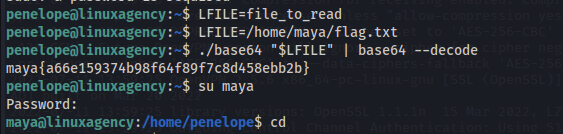
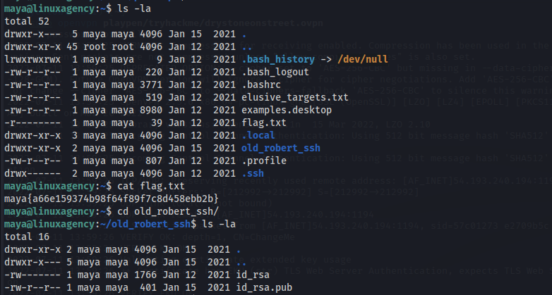
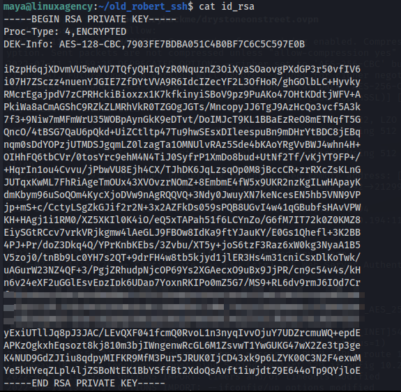
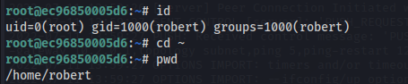
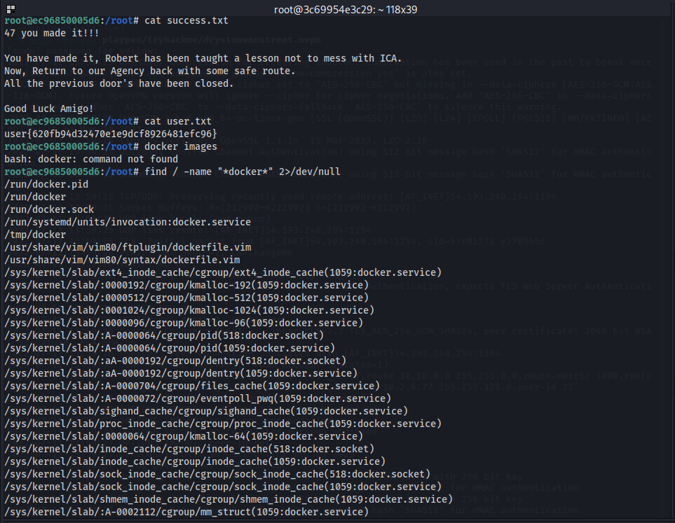
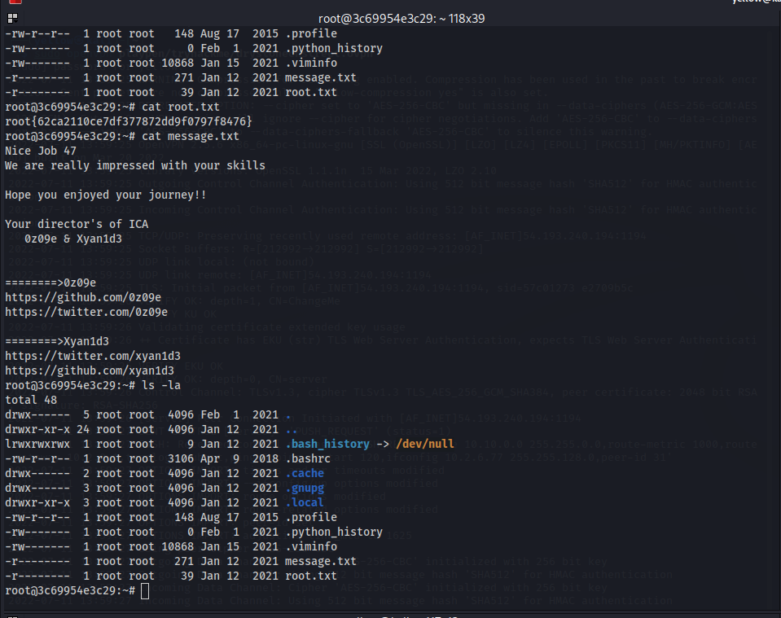

#### Linux Agency

##### Part 1: Funda
This is a Capture-the-flag exercise. It has different missions (just like the bandit overthewire challenge)

agent47: flag on login \
mission1: flag on listing \
mission2: flag on listing and (cat) reading \
mission3: flag on nano or less ing - uncatable \
mission4: flag in directory cd \
mission5: flag hidden with .flag.txt format \
mission6: flag hidden as .flag directory and file inside \
mission7:  bashrc file loads from the mission6 user, so use commands with care. cd properly into mission7 and ls to cat the flag \
mission8: listing from the root dir shows flag file in root has user and group as mission8. thats the flag here \
mission9: cat and grep ing the rockyou file for mission10 \
mission10: simple find search for flag.txt gives the file location \
mission11: no flag file. just checking the bashrc file says that there's base64 encoded which will be decoded when flag variable is asked to ouput its value on terminal $flag or $FLAG \
mission12:  flag is in the user dir, but has no permissions. enable permissions and brr \
mission13:  flag file in user dir, base64 encoded. decode to get the flag \
mission14:  flag file in user dir, binary 0s and 1s. convert from binary using cyberchef \
mission15:  flag file in user dir, hex nums. convert form hex using cyberchef \
mission16: file in user dir, unrcognisable gibber. turns out to be an executable. +x -> run to get flag \
mission17: flag is a java application. compile the java file (hint: says to get a cup of coffee which is javac to complie file) `javac flag.java` run java flag `java flag` to get the flag. \
mission18: flag is a ruby file. complie w/ `ruby flag.rb` to get the flag \
mission19: flag is a c file. compile w/ `gcc flag.c` and run `./a.out` to get the flag \
mission20: flag is a python file. compile w/ `python3 flag.py` to get the flag \
mission21: sh shell on system. no flag. cat bashrc file to get base64 encoded command. running it gives the flag \
mission22: python shell. use `import pty;pty.spawn("/bin/bash")` to get bash shell. flag in user dir \
mission23: message says you need curly hairs and hosts will help. `cat /etc/hosts` gives the mission24.com with a localhost running on IP address 127.0.0.1 curl ing on that ip `curl http//:127.0.0.1` gives some html stuff with title having the flag \
mission24: flag in .viminfo file \
mission25: basic bin commands are disabled; enable it using `export PATH=/usr/local/sbin:/usr/local/bin:/usr/sbin:/usr/bin:/sbin:/bin`  \
mission26: flag.jpg file, just use `strings flag.jpg` to see all strings in the file \
mission27:  flag file in user dir, zipped; gunzip the big flag file and strings it out to get the flag \
mission28:  shell is irb; access the reverse shell script command to get into sh; then run `/bin/bash` to get the bash shell (can check all user shells by `cat /etc/passwd` ) file txt.galf has the falg but reversed. cat the file and pipe it to `rev` \
mission29:   set auth on websites? files look like website files. a dir called bludit has files like .htpasswd which has the flag! \
mission30:  there's a git dir where user files exist; since we're looking for viktor's flag recursive search for files with search string "viktor{" >> outputs flag in 2 files. 

##### Part 2: Priv Esc
This feels like straight up hacking.. Gaining access to user machines from one user to another. \
This basically felt like taking things to another level.

accessing viktor's machine for dalia's flag \
**dalia's flag**: As per the hint provided - "train arrives as per schedule" > must be relavent to scheduling.. so when cat /etc/crontab is run there's a script 47.sh being run every 30 seconds. Adding bash reverse shell into the file and having a netcat run on local machine - access can be gained. flag in user dir.

**silvio's flag**: as per hint - 'Check the Postal Code on the address.' > the hint was wierd tbh. checking if I have sudo permissions there was a note: dalia can execute the zip file as silvio. `ZIP` ~ `Postal Addresses have ZIP code!` I'm a tubelight!
So, checked the GTFO bins where unix bin files can be abused to bypass security constraints and escalate or maintain priv. executing zip bin file on the system as instructed in gtfob, there's an empty terminal where passing `id` gives that uid=silvio but there's no bash terminal spawned. spawning it, and reading the flag.txt file in user dir gives the flag.

**reza's flag**: checking sudo priv, there's git bin file which can be executed as reza on silvio. checking for gtfob and respective code for git, sh shell is spawned to reza's machine. flag in user dir.

**jordan's flag**: checking sudo priv. there's a python script file Gun-Shop.py that can be run as jordan which doesn't have a module called shop. so create a shop.py file in */tmp* dir and provide the gtfob python script to break out of shell. set PYTHONPATH var to shop.py file location while running the Gun-Shop.py file as jordan to gain access to jordan's machine. flag in user dir.

**ken's flag**: checking sudo priv. can execute the less bin as ken. gtfob less and access is gained.

**sean's flag**: checking sudo priv. can run vim as sean. run vim as sean. flag not present in the user dir. find the flag using grep -iRL shows a long list of files. */var/log* file looks sus cause it's *log*. there's the flag plus some base64 encoded message right next to it. decoding it -> gives the password to penelope (next user machine).

**penelope's flag**: logging into penelope, the flag is present in the user dir.

**maya's flag**: there's a base64 suid file for maya in penelope's machine. gtfob for base64 bin file using suid file. using the message, can read the flag file in maya's machine in home dir.

**robert's passphrase**: using the flag, logged into maya's machine. 

There's a ssh key that's robert's. 

copy it, convert it using ssh2john to generate john format and crack the passphrase using john. cannot connect using passphrase to robert. logging in via ssh on tun0 machine IP using ssh key and passphrase is also not possible. checking network using socket stats, `ss` there's ssh running on port 2222 so running ssh on localhost port 2222 gives access.

**user.txt**: in robert's machine the machine name is different - no longer linuxagency and *robert.txt* file gives a strange message. 

checking the ip address gives the fact that we're on a docker container.  

checking sudo priv > `(ALL, !root) /bin/bash` .The sudo bin version is 1.8.21p2 which has an exploit [exploit-db ID: 47502](https://www.exploit-db.com/exploits/47502) >> uid=root access gained. 

user.txt in root dir

**root.txt**: search for docker bin files on system. there's one in */tmp/docker* called mangoman. 

using the gtfob for docker bin to gain docker host root shell. 

access check:

`cat /root/root.txt` will provide the final flag.

#### Conclusion
There's simple hoop to hoop jumping in the first half of the CTF. Getting the fundamentals proper. Later, jumping from machine to machine by absuing the bin files with acess to the next user to break out of current shell to their shell. Final three were intersting: taking an ssh key and sshkey_hash to crack the passphrase and gaining the passphrase (not password) to ssh into robert's machine which is a container. Abusing sudo bin file gain root access and then abusing docker bin file to gain host root access to complete the CTF.

For a beginner like me it was an absolute abundance of info which felt scary, just at the beginning. But understanding it made it a lot more approachable.
