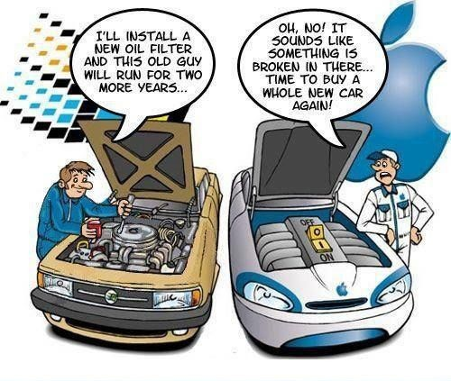
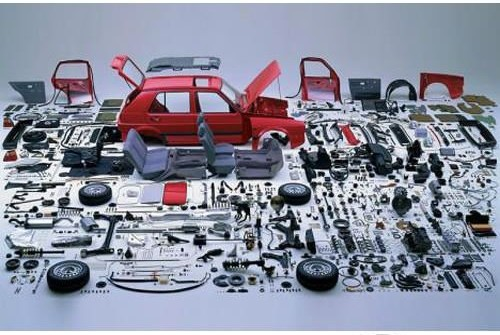
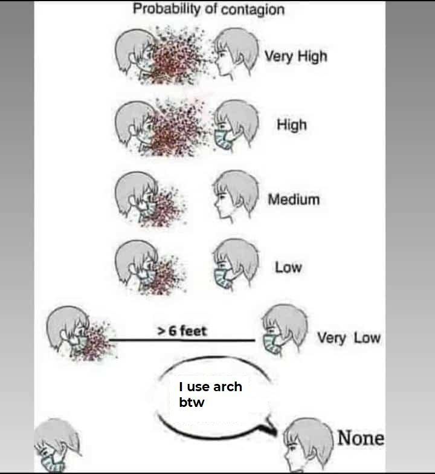

<!--%%deed done on 11th to 14th June Weekend and so on.. until the date of publishing%%-->
## Motivations..
I have been a simple windows user. some reasons I wanted to do use linux:
1. Just a complete understanding of how a computer system works.
2. having more control of the system. What to install, use and run.

Memes give a really accurate idea and this one cleared up real good.

But being a linux user be like:

So I downloaded and started using Ubuntu as dual boot. Later I got serious about it and deleted Windows 10. It felt like a big leap - the GUI and workflow was a drastic change. Speed of operation plummeted. Quite many bugs that had to be troubleshot for regular use. A simple amount of customization (here at first, they were GUI like GNOME tweaks - themes, Icons, top bar, cursor/pointer) meant changes. Changes meant wanted and/or unwanted ones. It felt good to know I had absolute control But I wasn't exercising it. So I tried different operating systems on my raspberry pi 4 .. like Debian, Kubuntu, Kali, Xubuntu, Lubuntu, Manjaro and I found out some stuff.

There's some stuff called packages. They provide applications and services that are same for OSes built on top of it. I knew dpkg and apt from ubuntu. Snap was new and annoying. Flatpak was new and intersting. There were more - the RPM and yum from Red Hat and Fedora, pacman and yay from Arch. There are others and for now I'm not diving there.\ 
What I underwent when I checked those OSes were visual changes - the GUI - desktop environments and window managers - which is a huge User Experience aspect to it. But yet, I 
- didn't know what linux user directories like */home*, */root*, */bin* and */sbin* etc were..
- wanted to have airtight control over system resources usage like CPU and RAM for optimal performance : if I'm not using it, I don't want it on my system or have it running in the background. 

Reasons: 
1. Ubuntu is overloaded w/ packages (~3500), GNOME is heavy, consumes too much of RAM (~1600 MB when just terminal's opened) and ended up having so many unwanted applications which are never used. 
2. Superior customization with multiple applications and library support
3. Has got good amount of online forum for system support (not as good as ubuntu which is the best - but Arch Forums are quite great)
4. even though apt has great packages that are stable (but old, atleast by 6 months), snap is intruding as default option for important applications.
5. Wanted to try out new package manager, rolling releases, up-to-date experience and be done with company releases to wait for new functionalities on DE
6. Wanted to explore different WMs without unwanted applications on system and rice those workspaces

More time on youtube named my quest/collection of thoughts properly - Quest **to become super user** - using my system and knowing completely about it, just from my terminal. Which is simple, absolute, efficient and cool.

The Linux distro I finally landed on was Arch - since it had all the things I needed when I first thought to migrate to Linux. And those wierd "I use arch btw" memes. 
{:height="300px" width="300px"}

yep, that *feeling*
{:height="500px" width="350px"}

There's even a [twitter account](https://mobile.twitter.com/archlinuxmemes)!

## Base Installation
After Base Installation, the system just provides a blank black screen with a terminal console line. Neat huh? At first it was quasi-duanting and quasi-wtf, definetly a clean start.\
So just to make sure I knew properly, I watched numerous tutorials on youtube from great channels multiple times which explain in a proper lucid manner.

I'm installing the OS as dual-boot, have got great storage but CPU and RAM can't be used simultaneously with VMware or virtualbox cause resources.

Referring the [arch installation wiki](https://wiki.archlinux.org/title/installation_guide), there's installation steps - USB bootup stick, connecting to network, set system time, create partitions, install base system, create hosts, fstab, vconsole, locale file for swap partition. I had just one partition - BIOS with MBR with a swap file instaed of a swap partition. 

Added a new user with strong password. Surprisingly, I didn't edit the sudoers but the visudo file (maybe an update) to provide the non-user casual user the super user priviliges. Boot file and grub wasn't downloaded, but instead the ubuntu grub is used to os-probe existing installed OSes.

## GUI  
Need to confess: the ricing part, I was honestly seduced by [r/unixporn](https://www.reddit.com/r/unixporn). Those amazing UI/UX.. uff

For GUI, there must be a display server that enables a destop environment. There's X11 (traditional) and wayland (new protocol that wants to be replacement). SInce wayland isn't ready (some minor issues) and **X11** is great on its own, went for xorg. Graphic drivers for intel card and xorg and xorg-init is installed. The X clients include applications and services.

Now moving ahead, great desktop environment like GNOME, KDE, Xfce exist but many unwanted applications and packages come with the master-package. \
Other options include just the window manager. Now installing this makes the system lean and compact. There are different types like tiling and stacking WMs. Stacking WMs are the common ones where windows can be overlapping and expandable. But tiling was something to try. \ There are many WMs like i3, dwm, bspwm, awesome, qtile and xmonad. **i3-gaps** looked good and simple. The config file looked simple to edit and poke around. \  
Compositor is also an important aspect to it, customising window appearances and behaviour, fixes tear issues when moving the window at a faster rate. **picom** fit the bill - most common one used with X11 display servers. *exec picom* command is appended to the i3 config file to execute on start-up. adding the picom.conf file to enable transparency effect on windows not under use. The one that is under use has zero transparency highlighting usage. 

After installation, append *startx* to the .xinitrc file to start i3 with Xorg server on boot up. The login screen or a display manager is redundant with the arch terminal console that appears on start up. One less thing to worry about. If required there are many, like ly, gnome DM, light DM, sdm, etc., (can also be installed for multiple WM menu support on start up).

On login, the i3 WM gives a black screen with small bar with system specs below. The i3 bar can be further edited in the i3 config file to add more system info to display and customise to my liking. Install **nitrogen** using the default i3-terminal-emulator. Open it and download some background images online with wget and store them in a location *~/pictures* that's accessible. Set the desktop background. 

## Basic System Usage enabling
**Rofi** was installed to easy launch the applications. **FIrefox** as browser for internet acesss.

Download another terminal application like **alacritty** (cause i always wanted to.. there are some recommended ones like st, urxvt but GPU-accelerated emulator can speed up terminal ps). FIrst things to install after a good terminal? Neofetch, htop.

Alacritty customization is done further with the font, font-size, background color (**Alacritty-themes** application is downloaded to set the colors) and other features to my liking. Other font like JetBrainsNerd Mono is downloaded for default terminal font and moved to */usr/share/fonts*. *fc-list* command shows if the system recognises the font ttf or other file downloaded on the system. Respective console theme is chosen to liking.

Another pacakge manager like AUR is installed which is an AUR helper tool
The default shell is bash. I went for **zsh** for the autocompletion and syntax-highlighting features. Also the prompt customization with oh-my-zsh is attractive. Plugins were downloaded and respectively stored in the config directory with oh-my-zsh and accessed or enabled with oh-my-zsh config file. 

**Polybar** is also downloaded to set a top-bar. Donwloading a config file from seraching github provides config files for themes. The info in the bar can be active window, worspace indicator, time, storage spcae %, CPU usage %, RAM usage %, Volume %, IP address, Battery %, Brightness % etc

**Vim** is also downloaded and .vimrc file is edited to add more featues, themes and functionalities. For further customizing and creating own IDE - **neovim** can be downloaded and used. Additional plugins provide a less space occupying awesome terminal IDE to use.

Terminal applications is installed like **ranger** to view system files is a lucid manner. **Thunar** can be donwloaded to have a GUI window to display files, just in case. **VLC** is downloaded as default media player. The default Image viewer is **feh**. 

**alsa-utils** is downloaded to control system sound on terminal. **brightnessctl and brillo** can be used to control system brightness on terminal. **lxappearence** is downloaded to customize the system spplication window theme to get a much darker theme like **arc-dark** theme. 

Keybindings are an important aspect to a system. It drastically improves workflow speed and makes it simply uniquly set to the user. I3 config file serves as the center to set the keybindings. Some basic system specs need to be controlled - they need to change to set change accordingly bu setting a keybinding to the action and send a notification on screen about said change. Most of the actions end up requiring a script to execute to run the application in the desired mode/option for particular operation. The action ends up being immensely quick, unique and difficult for the user to set-up.

In a system like windows, mac or rhel these are already set. Guess this is the downside at the beginning. Every action needs to be set by the user from scratch. These files can be pushed to github profile to save the actions and invoke whenever required.

## Ricing
At the beginning, the more difficult it is to rice an application the more beautiful the system looks. Looks matter. And it takes effort. Some applications can downloaded for the sole purpose to serve looks like widgets. \
My objective: Get a simple, crisp and clear color scheme to show info without unwanted applications installed, unwanted applications running in the background and complete control over application appearance. 

For all the applications above, creating and editing the config file in respective application's directory in the .config directory at home provides customization option for the displaying an application on screen. Respective color schemes can be applied to get a unform look that oh so plagues the beautiful worspaces as shown in the [r/unixporn](https://www.reddit.com/r/unixporn) subreddit. 

But I'll stop right here for now. I have a functioning system as of now, which looks simple and cool and that's enough for now. This can end up being addictive.

## System Specs

## Conclusions Drawn

| Pros                                                                | Cons                                                            |
| ------------------------------------------------------------------- | --------------------------------------------------------------- |
| Control Over Everything                                             | The better the looks are, the harder you need to work on        |
| System usage speed is super fast after some time                    | Need to spend a lot of time at the beginning for system setup   |
| Only required apps and required packages with dependecies installed | Customization is HARD                                           | 
| Complete system knowledge                                           | When there's a problem, putting out fires consumes time         |
| Low CPU usage                                                       | RAM Usage ends up same as Ubuntu or other light OS more or less |

- Do the deed to know what it's about but just focus on your job or operation. Don't cling on to that unique system and custom made workspace. 
- Diversify and be flexible.

---