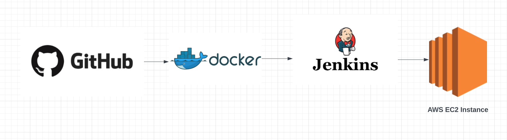
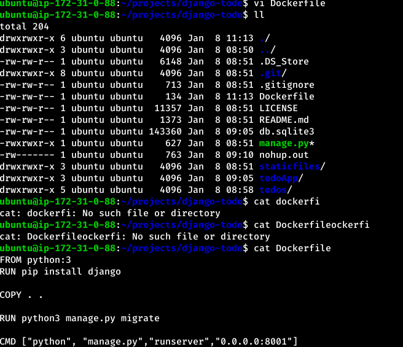
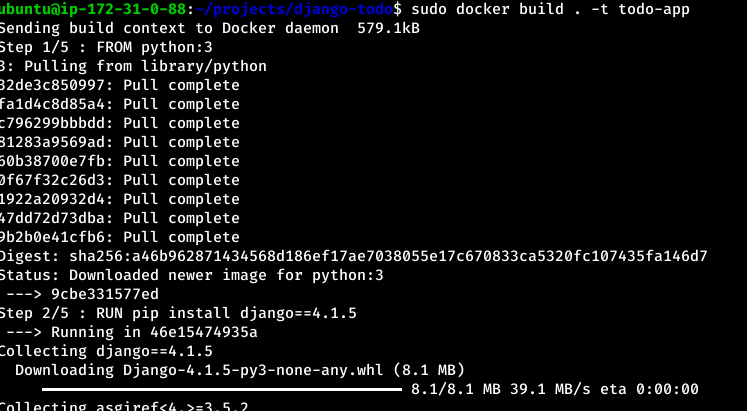
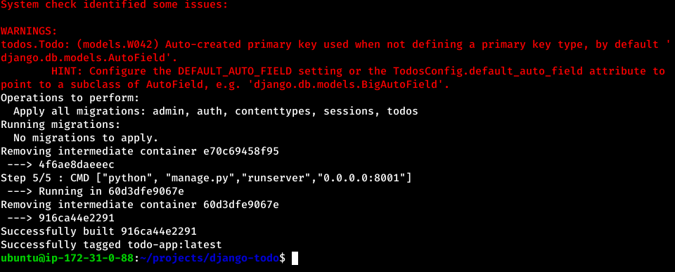
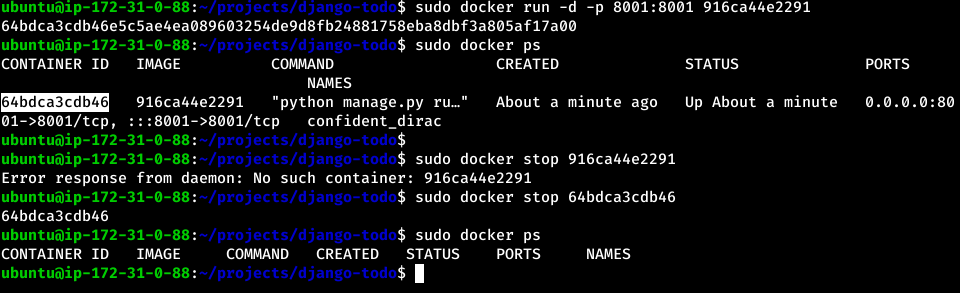
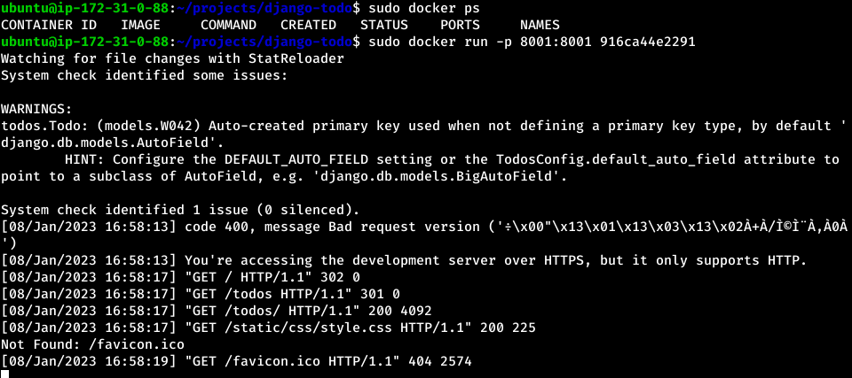
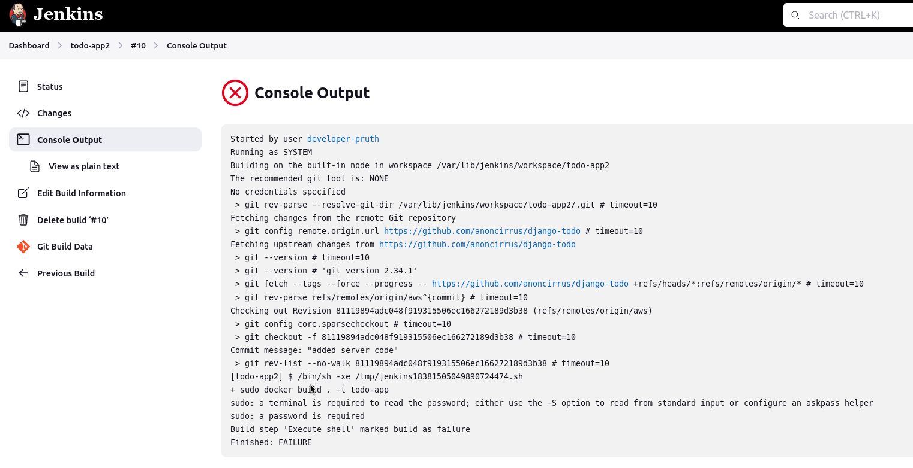
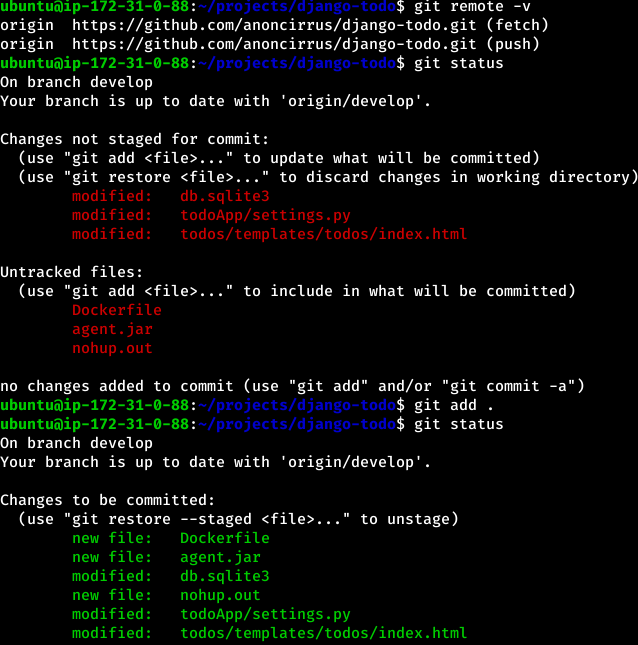
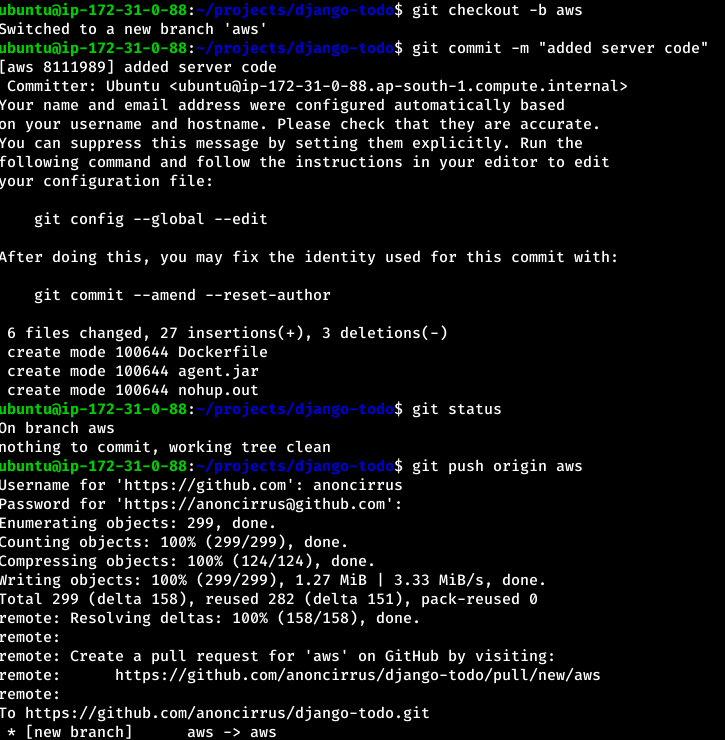
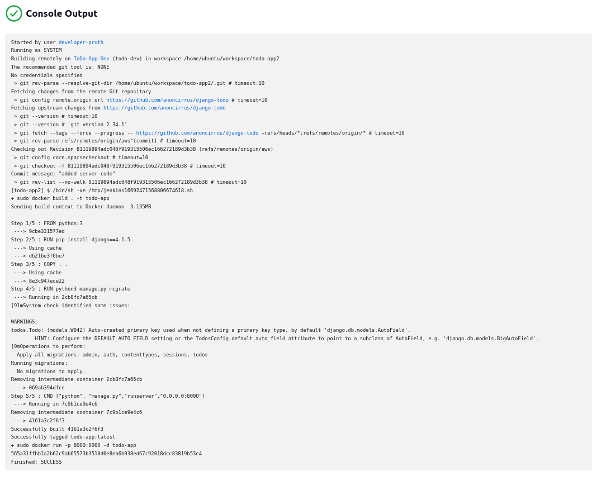

Aim: Building CI/CD Pipeline for a Django Web App in a Docker Container on AWS EC2 Instance using Jenkins automation server



Pre-requisites: 
1. create an AWS account and launch an EC2 ubuntu instance (updated)
2. docker and jenkins installed on the instance, create jenkins account
3. Django web app [source code](https://github.com/shreys7/django-todo) ready to be deployed 

Step by step action before CI/CD piepline building:

1. ran the django code on local machine in a virtual environment, and added the requirements.txt for application operation.
2. ran the same django source code on AWS instance to check and add security rules to allow port accessibility.
3. ran the same django code, but now in docker container on EC2 instance

created a Dockerfile with the following contents:

1. initialise ubuntu instance with python installed, 
2. install dependencies, 
3. copy source code from existing directory to docker, 
4. migrate the code and 
5. run them on server that's publicly view-able on 0.0.0.0, port 8001)

```
FROM python:3 
RUN pip install django==4.1.5

COPY . .

RUN python3 manage.py migrate

CMD ["python", "manage.py","runserver","0.0.0.0:8001"]
```



command to build docker:\
`sudo docker build . -t todo-app`





command to run docker, mapping docker_port:host_port:\
`sudo docker run -p 8001:8001 image_id` 



add -d to run it as daemon (program running in background)



checked if the web app is deployed on <u>http://instance_IP_address:port_alloted</u>

### Created Jenkins Continuous Deployment (CD) Pipeline 
Created agent/node and job on Jenkins

Ran the agent commands (curl to get agent.jar file and ran the java file in background) to keep agent online,

For the Jenkins job - added build scripts with following commands:\
1. go to project working directory, 
2. build docker with tag "todo-dev" and 
3. run the docker connected to instance on port 8000 in background.

```
cd /home/ubuntu/projects/django-todo
sudo docker build . -t todo-dev
sudo docker run -d -p 8000:8000 todo-dev
```

Checked if the web app is running on port specified on htttp://instance_IP:port_specified

Faced some errors on the way and had to handle them.



Faced issues due to changing the EC2 instance IP address after stopping them in each session and not updating the new IP address in *Manage Jenkins* > *Configure Jenkins* >  *Change Jenkins URL* -> so reverse proxy setup was broken. 

Node/Agent in Jenkins can stay online with updated IP address and build is successful. 

### CI/CD Pipeline, with Jenkins-GitHub Integration
To add the Integration Element into the activity, Source Code VCS needs to be connected with Jenkins Automation Server for constant updates.

Set the web app source code in working directory to my personal accessible git repo, where changes can be commited and tracked.

```
git remote -v 
git remote set-url origin https://github.com/anoncirrus/django-todo.git
```




Collected the GitHub secret key instead of password. add the secret key in jenkins *Configure System* > *GitHub servers* > *credentials* 

Created a new job with *Source Code Management* > Git > add *Repository URL* ; specify the branch name properly.

Since docker file runs the application on port 8000 as instructed in <u>Dockerfile</u>, shell command sto be added are to build and run the docker container.

Add *Build Steps* > *Execute shell* and commands: (since new job created for Integration too, changed the port in Dockerfile from 8001 to 8000 midway)

```
sudo docker build . -t todo-app
sudo docker run -p 8000:8000 -d todo-app
```

**Note:** Before building the job, make sure there's nothing running on the specified port and no docker is running.

Save and build. 



CI/CD pipeline is hence built. 

If there's any changes to be made to the source code, any updates, rebuild the job to see changes made (make sure to kill the previous docker container and restart the agent)