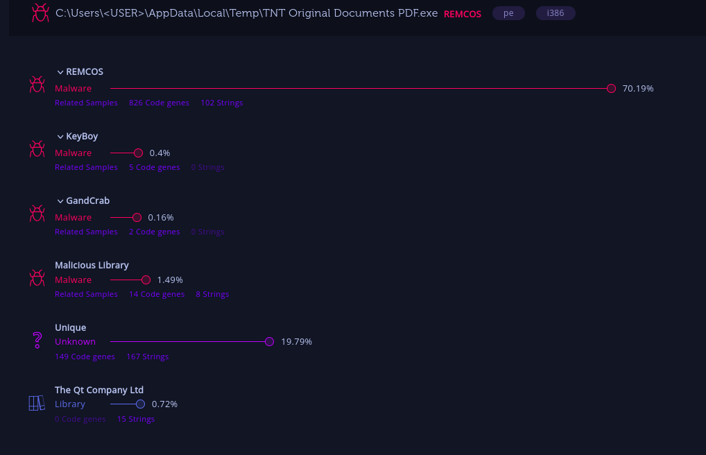
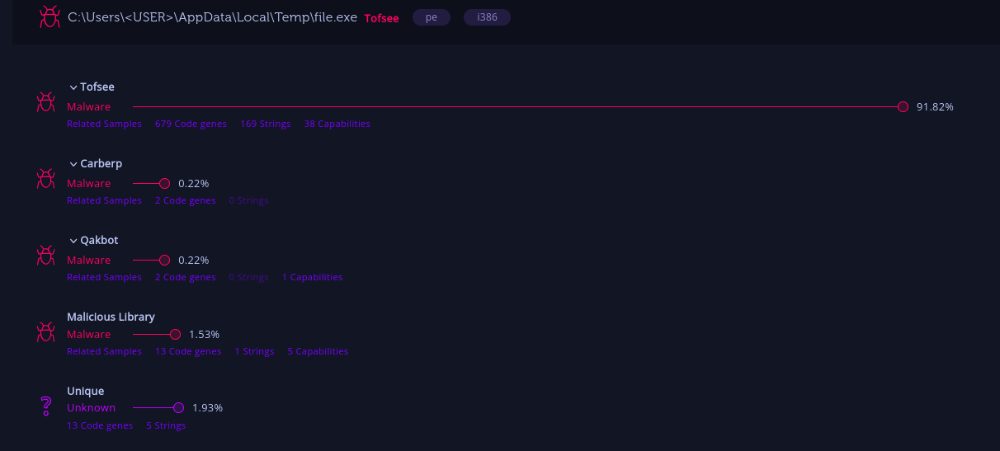
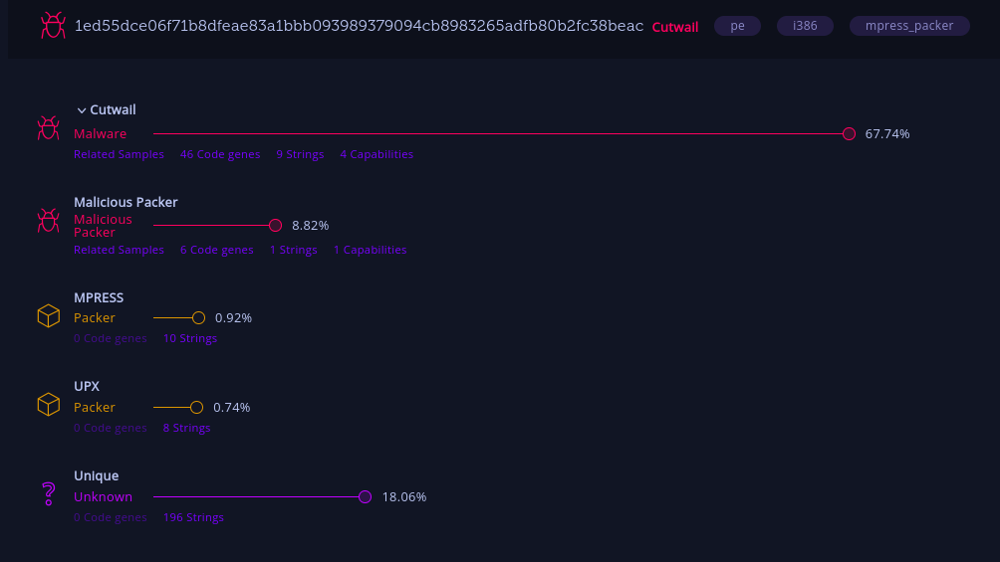
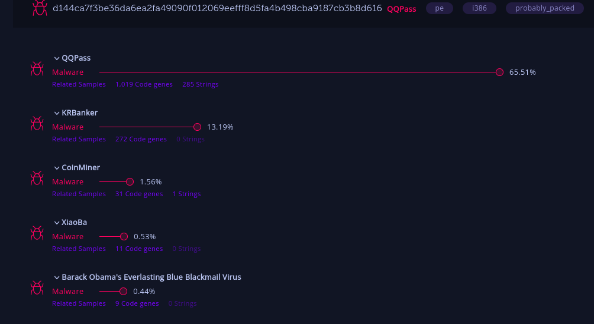
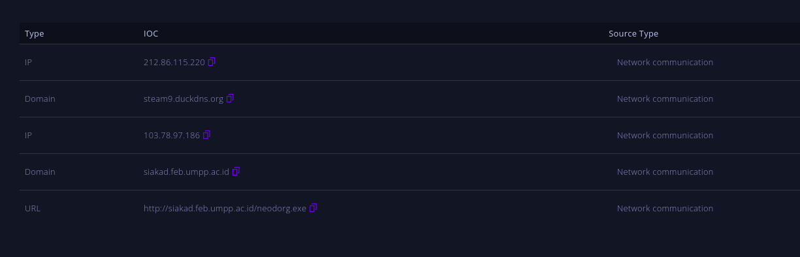
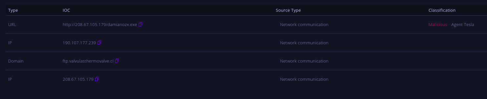
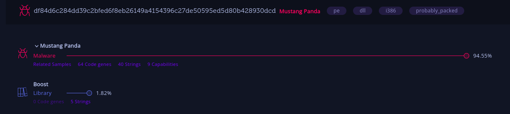
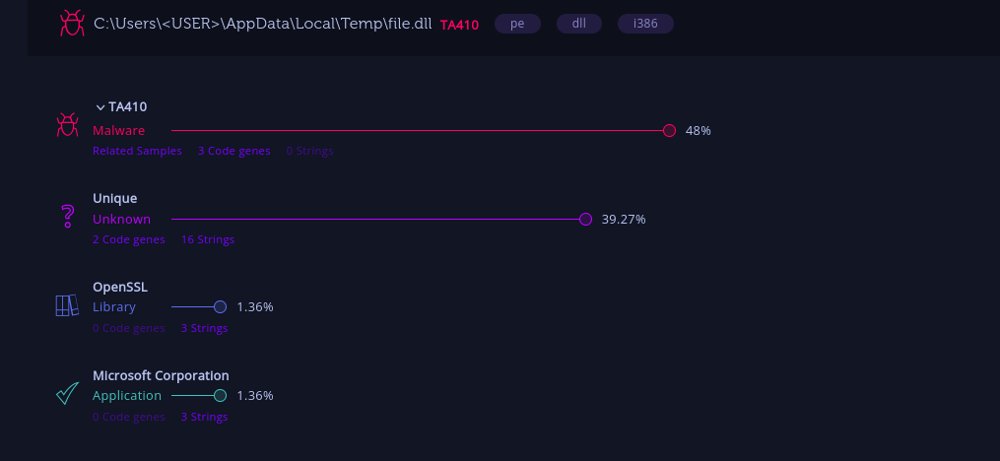

# Intezer tool
> Problem Statement:
> 1. Identify - Top 5 Publicly Trending Threats in scan option
> 2. Add any 10 IOC Ip Adress of any threats
> 3. Add details in report about 2 Sample Threats in Endpoint option

## Top 5 Publicly Trending Threats 
1. REMCOS

2. Tofsee

3. Cutwail

4. QQPass

5. Malicious Packer

## 10 IOC IP Address of Threats
Threat - Ave Maria

Threat - Agent Tesla

Threat - Formbook

## Sample Threats in Endpoint
1. **Mustang Panda**  

Country of Origin: China
Synonyms: BRONZE PRESIDENT, HoneyMyte, Red Lich, Mustang Panda - G0129, TA416, RedDelta

This threat actor targets nongovernmental organizations using Mongolian-themed lures for espionage purposes. In April 2017, CrowdStrike Falcon Intelligence observed a previously unattributed actor group with a Chinese nexus targeting a U.S.-based think tank. 

Further analysis revealed a wider campaign with unique tactics, techniques, and procedures (TTPs). This adversary targets non-governmental organizations (NGOs) in general, but uses Mongolian language decoys and themes, suggesting this actor has a specific focus on gathering intelligence on Mongolia. These campaigns involve the use of shared malware like Poison Ivy or PlugX. 

Recently, Falcon Intelligence observed new activity from MUSTANG PANDA, using a unique infection chain to target likely Mongolia-based victims. This newly observed activity uses a series of redirections and fileless, malicious implementations of legitimate tools to gain access to the targeted systems. Additionally, MUSTANG PANDA actors reused previously-observed legitimate domains to host files.

2. TA410

Early in August 2019, Proofpoint described what appeared to be state-sponsored activity targeting the US utilities sector with malware that we dubbed “Lookback”. Between August 21 and August 29, 2019, several spear phishing emails were identified targeting additional US companies in the utilities sector. 

The phishing emails originated from what appears to be an actor-controlled domain: globalenergycertification[.]net. This domain, like those used in previous campaigns, impersonated a licensing body related to the utilities sector. 

In this case, it masqueraded as the legitimate domain for Global Energy Certification (“GEC”). The emails include a GEC examination-themed body and a malicious Microsoft Word attachment that uses macros to install and run LookBack. (Note confusion between Malware, Campaign and ThreatActor)

