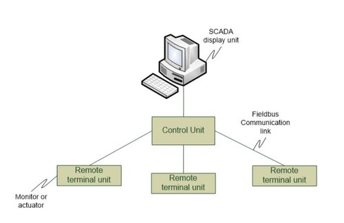
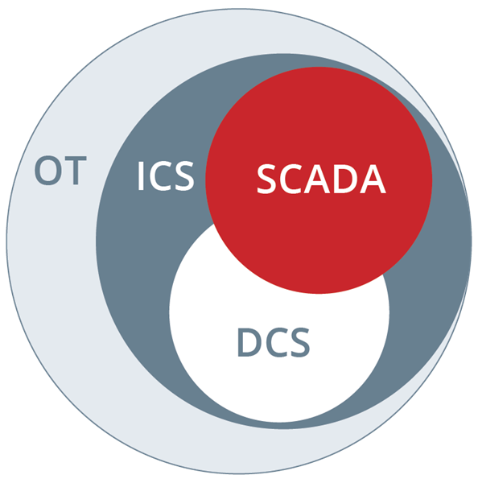
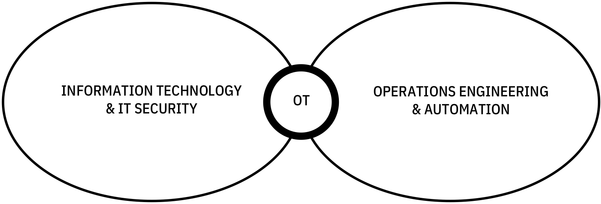
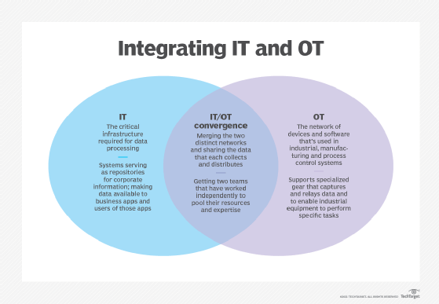
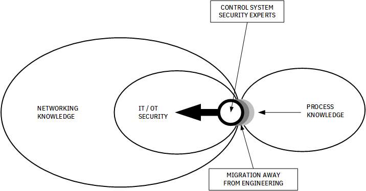
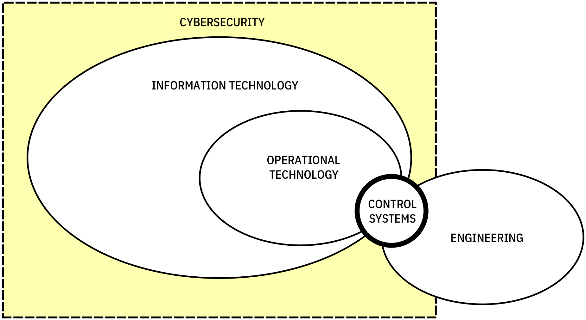

Information Technology (IT) is the study or use of systems (especially computers and telecommunications) for storing, retrieving, and sending information. (data processing functions)

IT priorities can be listed as Confidentiality, Integrity and Availability (in that order)

Operational Technology (OT) are hardware and software computing systems that are used to manage, control industrial, manufacturing and process control systems' equipment, assets, processes and events. Some operational systems include production line management, mining operations control, oil & gas monitoring etc.

OT priorities can be listed as Availability, Confidentiality and Integrity (in that order) (objective at hand being information for process control)

Industrial Control Systems are a major segment of OT that monitor and control industrial processes. This could be mine site conveyor belts, oil refinery cracking towers, power consumption on electricity grids or alarms from building information systems. ICSs are typically mission-critical applications with a high-availability requirement.

The SRP triad of ICS priorities are Safety, Reliability and Performance (in that order) (focuses on safety and availability of systems, as opposed to OT - process control and IT - information processing)

Industrial control systems (ICS) are often managed via a Supervisory Control and Data Acquisition (SCADA) systems that provides a graphical user interface for operators to easily observe the status of a system, receive any alarms indicating out-of-band operation, or to enter system adjustments to manage the process under control.

Supervisory Control and Data Acquisition (SCADA) systems display the process under control and provide access to control functions. A typical SCADA configuration is shown in figure

Distributed Control System (DCS) is a type of process control system that connects controllers, sensors, operator terminals and actuators. The data acquisition and control functions are performed by distributed processors situated near the peripheral devices or instruments from which data is being gathered.

While DCS and SCADA are functionally very similar, DCS is generally employed at large, continuous processing facilities. Operations are almost always controlled onsite rather than remotely.

Terms like OT, ICS, SCADA, DCS can be classified into domains as shown below:

## Integrating IT with OT
Clearly, the following model is primarily focused on the networking aspect of the increasing number of network-based SCADA/ICS environments, and their deployments.

It is easier to teach and convert IT/IT security talent to OT/OT security talent than it is to convert engineers and automation professionals to OT/OT security talent.

Identifying clear roles and responsibilities within any given organization shows who owns, operates, and maintains command and control (C2) over SCADA/ICS equipment, its operation(s), both onsite-premised and distributed. 

Hence, there appears to be a paradigm shift to the left whereby the hands-on aspect of cybersecurity of process control systems are increasingly falling under the auspicious of IT rather than engineering

The Infracritical’s Hybridized Model is hence selected to be implemented, as one deals with the breakdown of network-based SCADA/ICS environments, whereas the other demonstrates clearly defined roles and responsibilities insofar as to training, awareness, and roles for both network and non-network-based SCADA/ICS environments.

However, one nagging question remains – where does cybersecurity versus operational security (OPSEC) roles and responsibilities (with any given organization) – _begin and end_?

OPSEC limits its scope to process and operational conditions of a plant’s operation(s) – _not how data is transmitted to/from everything that is interconnected_. Although engineering does provide support, contributing to systems that are typically the responsibility of IT, OT, and real-time systems groups, there continues to be a need for a translator who can converse with **all** levels of expertise (see alternative model shown below).

It should be noted that real-time systems staff may consist of either IT, or engineering, or both - as subject matter experts. This creates a groundswell, nudging movement in a direction leading to the hybridized model that is so deperately needed to embrace cybersecurity within SCADA/ICS environments.

However, this may not always be necessarily the circumstance as real-time systems may supplement engineering subject matter experts with IT staff who may have (or had) some engineering experience and/or formal training or education pertinent to engineering.