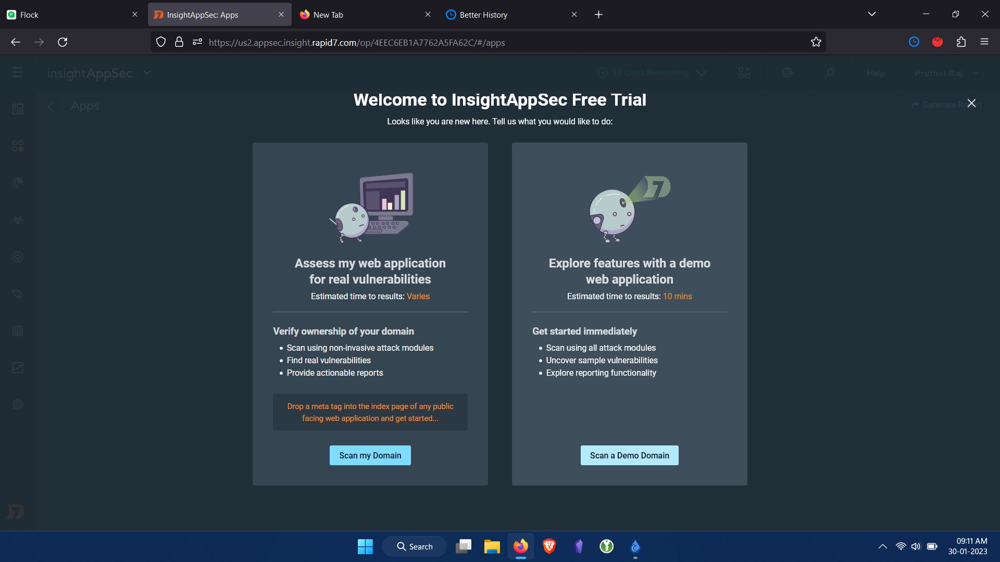
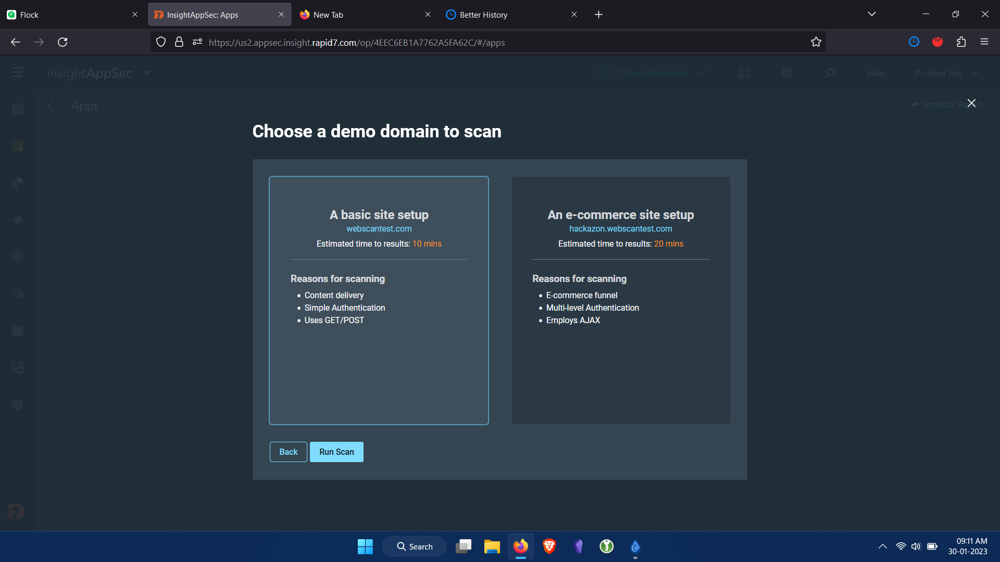
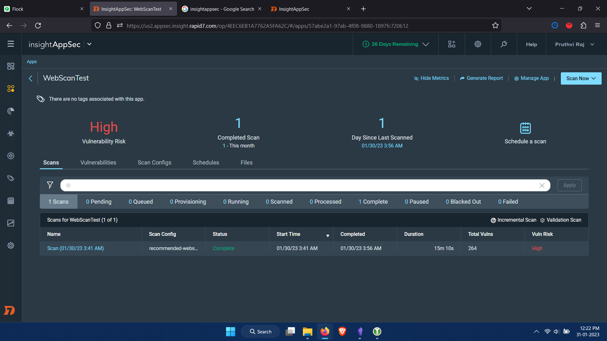
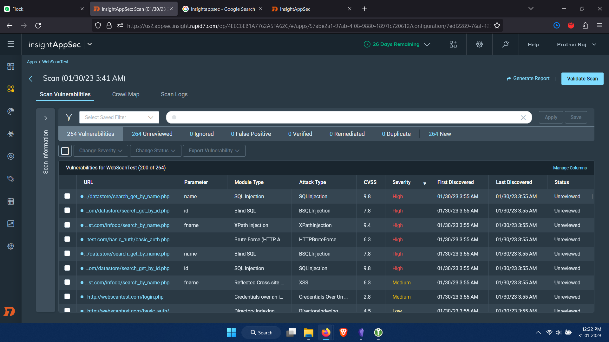
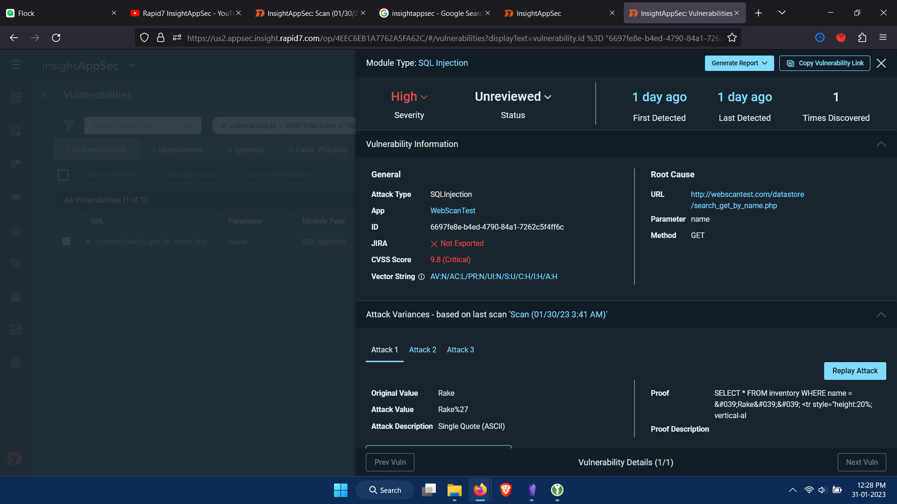
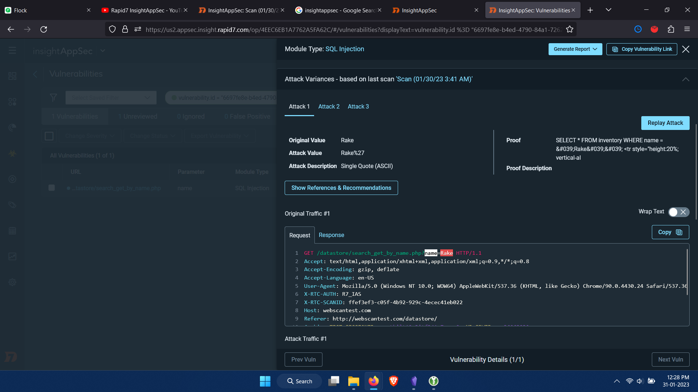
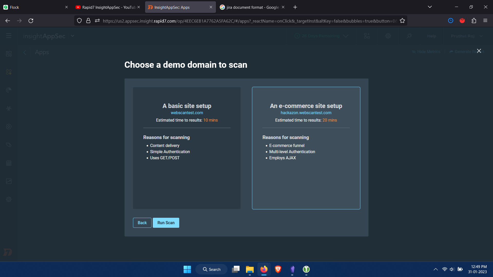
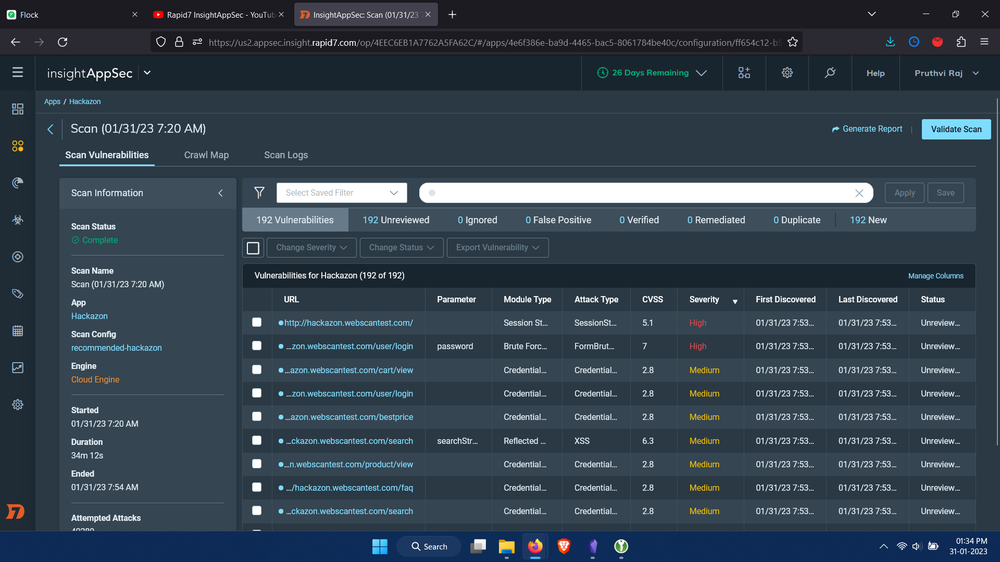
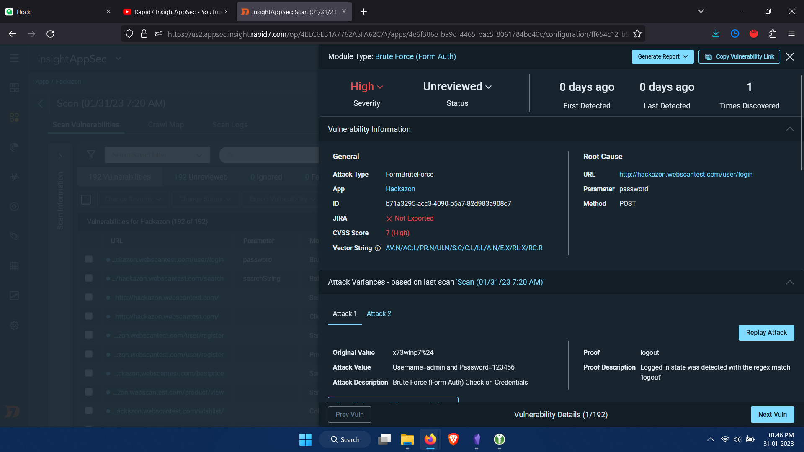

> Problem Statement:
> 1. Create a detailed report on vulnerabilities scanned on any 2 web application include vulnerability screenshot and your understandings about the tools.

# Rapid7
The company Rapid7 has the insight platform for security solutions. InsightConnect (orchestrationa dn automation), services (expert managed and consulting services), InsightVM (vulnerability management), ThreatCommand (Threat Intelligence), InsightIDR (XDR, SIEM), InsightCloudSec (Cloud Security) and InsightAppSec (Application security dynamic application testing platform) 

InsightAppSec performs black-box security testing to automate identification, triage vulnerabilities, prioritize actions, and remediate application risk.

**Dynamic Application Security Testing (DAST)**  - Get actionable, accurate insights with an industry leading attack framework and library

**Replay attacks & validate fixes** - Speed up remediation and reduce dev team back-and-forth by providing self-service access

**Integrate into dev workflows** - Better prevent risk early by adding security testing as part of the build pipeline and integrating dev and sec team workflows

Opening the tool, it offers demo web app on which scanning can be done to uncover sample vulnerabilities.

A basic site setup can be chosen to work on and it is WebScanTest is done to scan throughly.





This scan uncovers 264 vulnerabilities, with the most critical ones displayed first in the list.


Checking the first vulnerability for details, its CVSS score of 9.8 is a module type of SQL injection. Numerous details like Vulnerability Information, Attack variances discovery history and change history are shown.



The response can also be seen in html form. The Attack variances shows the original traffic request:



```
GET /datastore/search_get_by_name.php?name=Rake HTTP/1.1
Accept: text/html,application/xhtml+xml,application/xml;q=0.9,*/*;q=0.8
Accept-Encoding: gzip, deflate
Accept-Language: en-US
User-Agent: Mozilla/5.0 (Windows NT 10.0; WOW64) AppleWebKit/537.36 (KHTML, like Gecko) Chrome/90.0.4430.24 Safari/537.36
X-RTC-AUTH: R7_IAS
X-RTC-SCANID: ffef3ef3-c05f-4b92-929c-4ecec41eb022
Host: webscantest.com
Referer: http://webscantest.com/datastore/
Cookie: TEST_SESSIONID=ansetkilt12c3itf341m7uscs2; NB_SRVID=srv36063239
X-RTC-REQUESTID: {F668CC2D-09E9-4230-BEEC-BEB664814846}
```

The attack traffic requests too:

```
GET /datastore/search_get_by_name.php?name=Rake%27 HTTP/1.1
Accept: text/html,application/xhtml+xml,application/xml;q=0.9,*/*;q=0.8
Accept-Encoding: gzip, deflate
Accept-Language: en-US
User-Agent: Mozilla/5.0 (Windows NT 10.0; WOW64) AppleWebKit/537.36 (KHTML, like Gecko) Chrome/90.0.4430.24 Safari/537.36
X-RTC-AUTH: R7_IAS
X-RTC-SCANID: ffef3ef3-c05f-4b92-929c-4ecec41eb022
Host: webscantest.com
Referer: http://webscantest.com/datastore/
Cookie: last_search=%3Cscript%3Ealert%6014532645%60%3C%2Fscript%3E; TEST_SESSIONID=ansetkilt12c3itf341m7uscs2; NB_SRVID=srv36063239
X-RTC-REQUESTID: {FECC5626-DFF0-4A78-A29A-FCA051ABC610}
X-RTC-ATTACKTYPE: SQLInjection
```

```
GET /datastore/search_get_by_name.php?name=SELECT%20*%20FROM%20inventory%20WHERE%20name%20%3D%20%26%23039%3BRake%26%23039%3B%26%23039%3B%0A%09%09%09%09%09%09%3Ctr%20style%3D%22height:20%25%3B%20vertical-al HTTP/1.1
Accept: text/html,application/xhtml+xml,application/xml;q=0.9,*/*;q=0.8
Accept-Encoding: gzip, deflate
Accept-Language: en-US
User-Agent: Mozilla/5.0 (Windows NT 10.0; WOW64) AppleWebKit/537.36 (KHTML, like Gecko) Chrome/90.0.4430.24 Safari/537.36
X-RTC-AUTH: R7_IAS
X-RTC-SCANID: ffef3ef3-c05f-4b92-929c-4ecec41eb022
Host: webscantest.com
Referer: http://webscantest.com/datastore/
Cookie: last_search=%F6%3Cscript%3Eprompt%6014532652%60%3C%2Fscript%3E; TEST_SESSIONID=ansetkilt12c3itf341m7uscs2; NB_SRVID=srv36063239
X-RTC-REQUESTID: {16C58994-20A3-4D0B-8438-D25D6190F9A9}
X-RTC-ATTACKTYPE: SQLInjection
```

Each of such vulnerabilities and their attack traffic request and reponse can be assessed. The number of attack traffic varies form vulnerability to vulnerability.

Each such vulnerability can be chosed and their severity can be changed (high, low, medium, informational, safe), status (unreviewed, ignored, false positives, verifired, remediated, duplicates) can be changed and each vulnerability can be exported (to JIRA ticketing system integration or CSV file format).

Similary, an ecommerce site is scanned.



results of the app scan is as follows:



Listed vulnerabilities are sorted with increasing CVSS score first:
The first vulnerability shown is the brute force (form authorization)
Numerous details like Vulnerability Information, Attack variances discovery history and change history are shown.



Similar traffic data, attack traffic of request and response are displayed.

Integrating tool results with JIRA can issue alerts for each vulnerability.
CSV file can be downloaded and basic information can be used in other tool without integration support to transfer data.

DAST is successfully conducted and replay attacks log information is generated.