# Cybereason EDR
> Problem Statement:
> 1. Create a detailed report on Lateral movment , Command & Control, & Detected ransomare program 
> 2. In Malop box, write a detailed report on alert detected in Robert-excasst system

EDR is an array of modern, integrated endpoint security tools that detect, contain, investigate, and eliminate invasive cybersecurity threats high in the cyber kill chain. With Cybereason EDR, defenders can stop chasing alerts and instead end malicious operations before they take hold.

Delivering complete endpoint protection from a single, lightweight agent, Cybereason EDR is a full-featured EDR solution designed to catch, analyze, and defend against highly advanced network threats in real-time directly at the endpoint

About the company:
Cybereason is the champion for today’s cyber defenders with future-ready attack protection that extends from the endpoint, to the enterprise, to everywhere. The cybereason Defense Platform combines the industry’s top-rated detection and response (EDR and XDR), next-gen anti-virus (NGAV), and proactive threat hunting to deliver context-rich analysis of every element of a malicious operation (Malop). The result: defenders can end cyber attacks from endpoints to everywhere

Features include:
1. Light endpoint agent
2. Layered malware detection and defense
3. Pre- and post-execution malware inspection
4. Threat feed integration
5. In-memory and application-layer protection
6. Centralized management and user interface

## Features Insights
### Threat Intelligence
Many different threat feeds often do not agree with each other on which IOCs are malicious or unknown. This conflicting information makes it difficult to quickly determine the maliciousness of a threat and take action.

Cybereason Threat Intelligence aggregates multiple threat feeds and cross-examines those feeds against machine learning analysis to rank the various threat feeds based on their historical accuracy for particular types of threats from various adversary groups. This enables Cybereason to determine the correct threat intelligence source to respond quickly and with precision, which simplifies the investigation and response process.

### Instant Remediation
Analysts of all skill levels can quickly dig into the details of an attack without crafting complicated queries, then easily pivot directly from investigating to remediating affected devices by executing a full suite of remediation actions from machine isolation and process killing to removing persistence mechanisms - all from within an intuitive point and click interface.

### Detection Speed and Accuracy
Cybereason EDR can identify threats quickly with a high degree of accuracy using behavioral analysis that leverages cross-machine correlations and enriched data from across all endpoints in real-time, and the Cybereason cross-machine correlation engine drives an impressive 1:200,000 analyst-to-endpoint ratio, significantly reducing the workload for security teams.

### ML-Powered Detection and Correlation of Malicious Behaviors
The Cybereason Defense Platform’s AI surfaces advanced threats by detecting subtle indicators of behavior. Certain malicious behaviors are only identifiable after analyzing enterprise-wide data sets against machine learning. Monitoring via a machine-by-machine basis only can overlook nuanced adversaries whose activity can only be detected when the environment as a whole is analyzed and cross-examined against machine learning.

Once a threat is convicted of being malicious, Defenders need to know the context and other correlated events to deconstruct the entire operation. Cybereason EDR implements machine-learning based deduction to find other artifacts of the operation that are connected to the initial event and compose an automated timeline for rapid response.

### Proven Efficacy
Cybereason EDR earned the highest product score for the “current offering” category in the 2020 Forrester Wave for Enterprise Detection and Response, and the MITRE ATT&CK evaluations highlight the superior proficiency of Cybereason EDR in quickly detecting and correlating threats to instantly deliver the complete story of an attack as an easy to interpret, interactive visual representation.

### Research-Driven Insight
The Cybereason Nocturnus Team evaluates new methodologies to sharpen our prevention, detection and response strategies, uncovering both Indicators of Compromise (IOCs) and key Indicators of Behavior (IOBs), the more subtle signs of an attack derived from across the whole of your network. Whether on premises, mobile or in the cloud, Cybereason is the defender’s choice to reverse the adversary advantage.

## Getting Started
Opening the tool provides Malop (Malware Operations) Inbox where the lab displays some detected activities on dashboard dashboard.

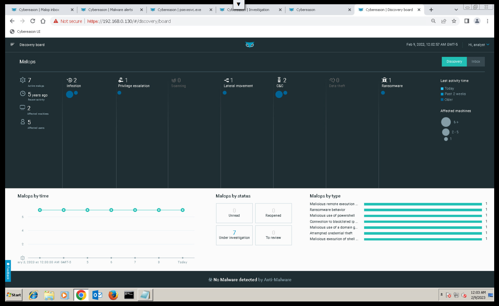

Some malicious tactics of attackers include:
Command and Control (C2) action done after an attacker gains access of a system or network to command access of malicious operations and gain and maintain control of the system.

Lateral Movement means after gaining access to one system of a network, attacker tries to move in the network in same group of permissions to gain more sensitive intel and increase value of their extorted data set.

Privilege Escalation is a type of attack that tries to gain unauthorized access to systems with more permissions or have access to data with higher critical nature in a network after gaining access to some systems.

Infection means to gain unauthorized access to system and ransomware detection is as it says: detecting ransomware.

Given all alerts are sorted by detected activity, time, root cause and machine.
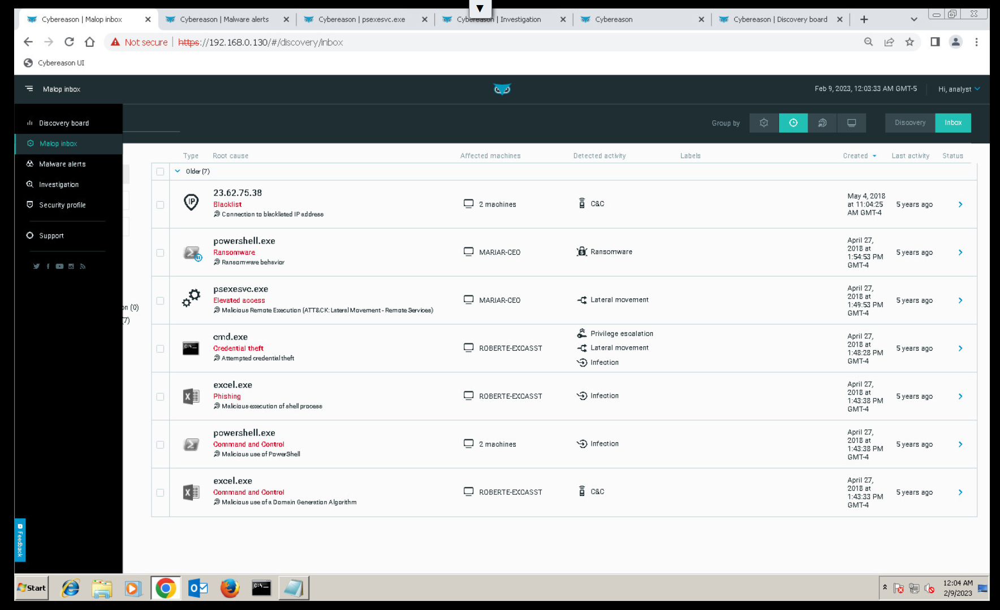

When viewd according to time, starting from bottom to top: there's the infection that occurs first by macro process run when `excel.exe` is executed as IOC (Indicator of Compramise) on ROBERT-EXCASST machine (since as shown in the lab, the tool sensor/collector agent is instaled on two machines) and `powershell.exe` on both MARIAR-CEO and ROBERT-EXCASST machines.

Complete overview about the `excel.exe` is shown as follows,
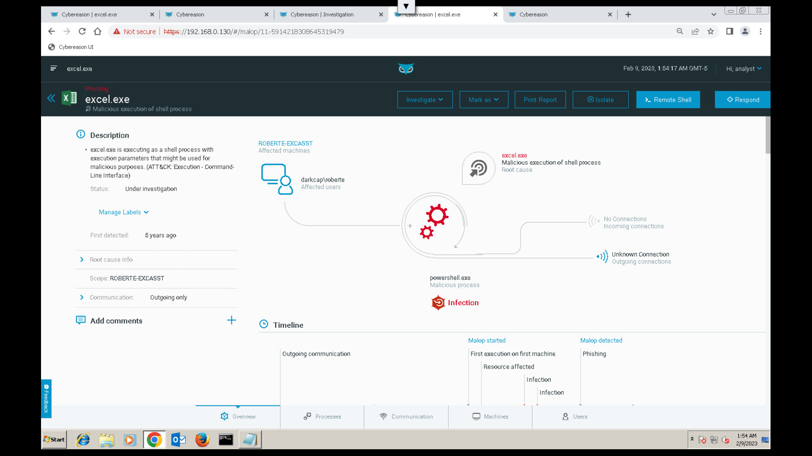

The timeline shows when `excel.exe` was executed as infection action during the malware operation **malop**.

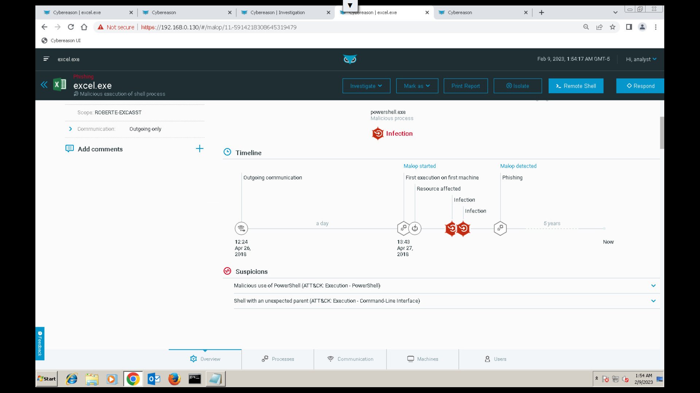

Looking into what the solution provides on `excel.exe` , that was run on ROBERT-EXECASST machine,

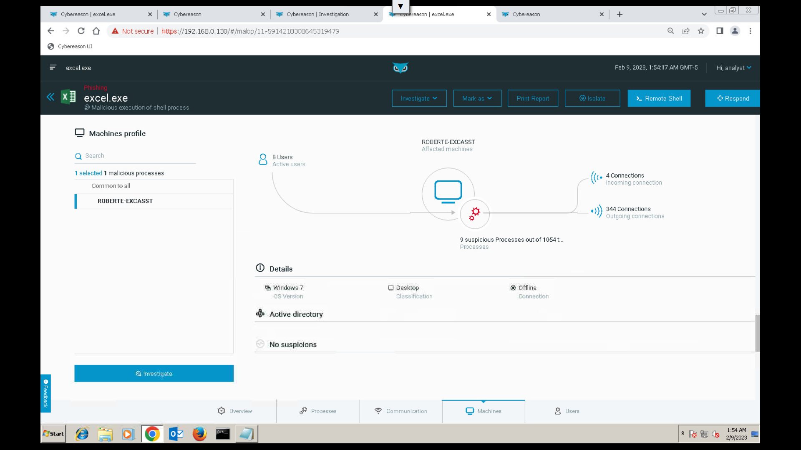

The `psexesvc.exe` is another binary executable file is run for lateral movement from MARIAR-CEO and `powershell.exe` is run on MARIAR-CEO as ransomware. 

`powershell.exe` is also executed as part of infection activity on both hosts which has it's overview displayed by the solution as follows,

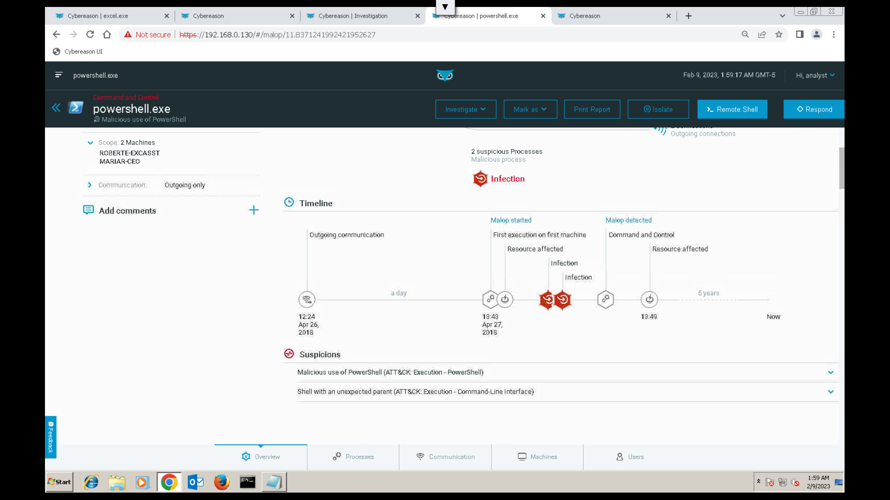

In the given lab, some activities like Command and Control (C2) had an `IP address 23.62.75.38` thats recognised and blacklisted (which affected 2 machines) and excel.exe file that ran a macro process that affected one of the system ROBERT-EXCASST and MARIAR-CEO system affected by powershell.exe - which is detected as a ransomware.

## Investigating alerts from host ROBERT-EXCASST
An investigation can be opened relevant to a particular TTP or element or contributing factor. Here the alert seen on a machine say, ROBERT-EXCASST the details can be viewed as follows:

Basic Properties like system name, OS, type, domain, timezone, uptime are displayed for proper introction about the system details.

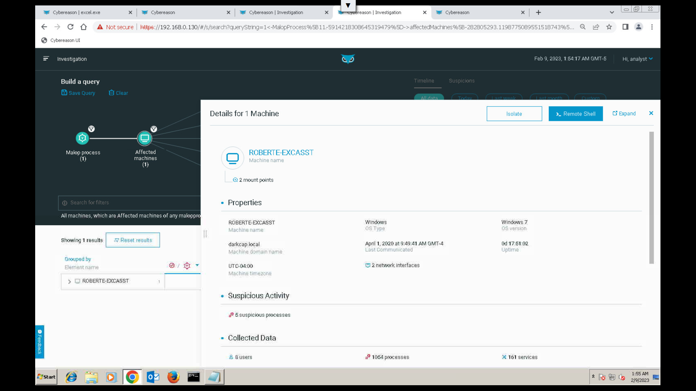

Suspicious activity is shown by their processes and the complete collected data is also displayed. Further more, system properties are also shown.  
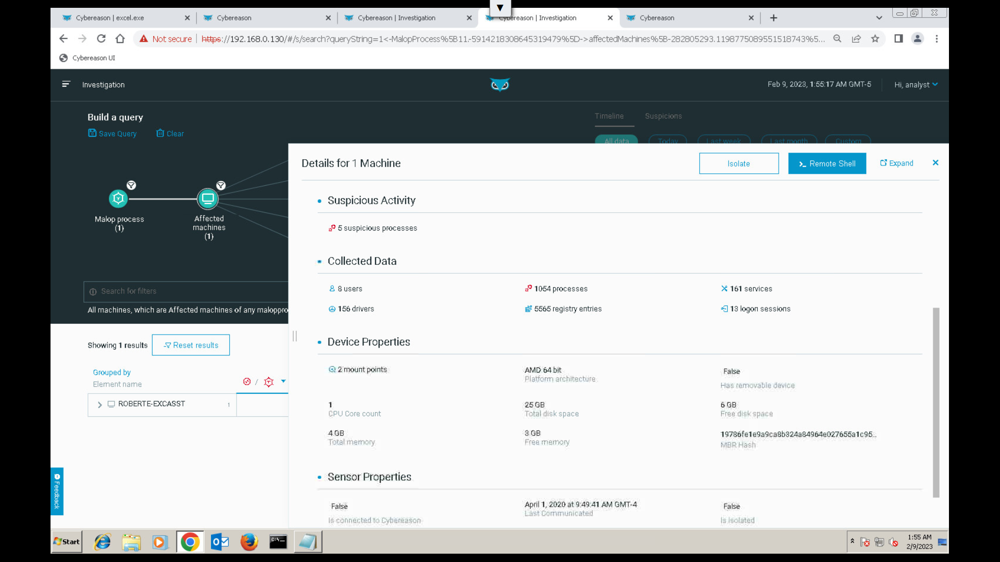

Sensor propeties installed on the host machine in the network for EDR solution to gain data is also shown.
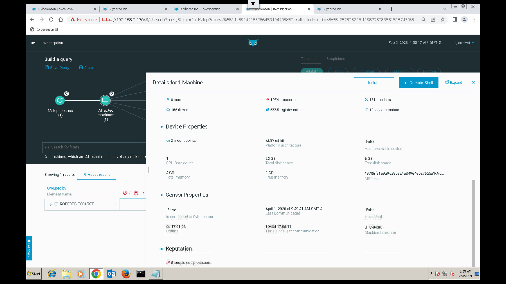

## Further more digging..
Investigation on the basis of process can also be seen with one under inspection. Here, `excel.exe` is seen.

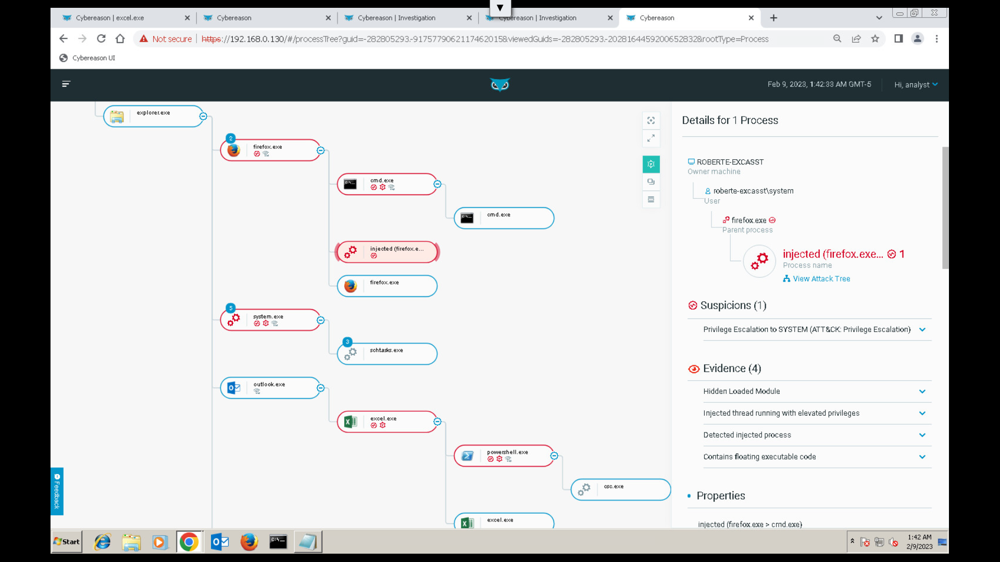

This provides an even better info about differt tools utilized by the attacker on the victim.

Investigation based on different factors can also be done: Machine, User, Process, File, Connection, Domain name, Malop process, DNS query unresolved by IP and many others.
Some hunting queries are already saved.

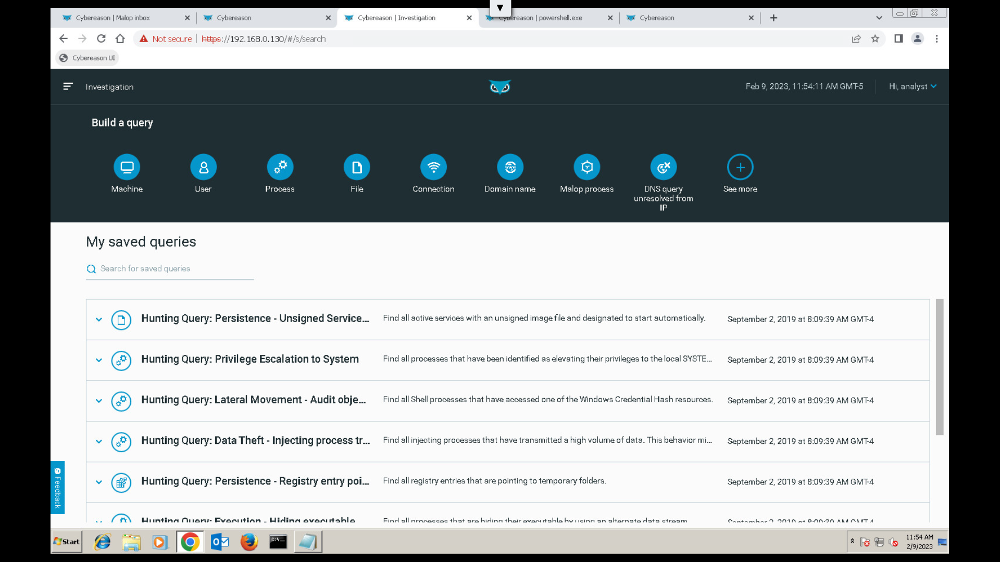

## Conclusion
The EDR tool offered by Cybereason recognises suspicious activity - by it's functionality Endpoint Detection and Response, from the hosts thanks to installed sensors. These data collected are properly mapped accordingly with respect to detected activity, time, root cause and machine. Different attack vectors are recognised. 

Critical alerts are shown in a seperate tab with detail specificity. Further more, different profiles can be created by adding whitelisting rules, custom detection rules and reputation of each recognised activity can be searched.