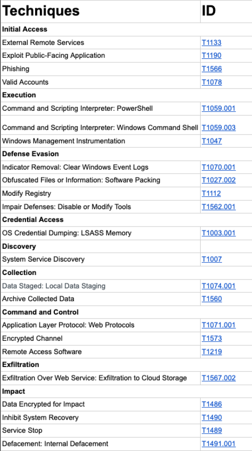

With a statement from FBI officials on August 25, 2021 it was said that a newly formed ransomware group **Hive ransomware** group is attacking the health system in the USA. The Hive ransomware gang crashed the IT systems at Memorial Health System, disrupting healthcare and putting the lives of several patients at risk. First observed in June 2021, Hive Ransomware is a RaaS (Ransomware as a Service) group leveraging double-extortion that started operations. The group also exfiltrates sensitive data before encrypting it for ransom. They operate with an affiliate system and provide an admin panel for affiliates to manage attacks.

They are believed to be a Russian-based organization. It is reported that around May 2022, some of its affiliates migrated to Hive as the Conti group took down its attack infrastructure. The belief stems from the fact that Conti and Hive have leaked the same victims on both their leak sites simultaneously on multiple occasions, such as the attack on Costa Rican government infrastructures. However, Hive refuted the connection with Conti in their TOR leak site in numerous instances.

## How does the group work?
The FBI noted that the Hive gang used multiple tactics, techniques, and procedures (TTP) to compromise targeted networks. According to the report, the ransom group leverage phishing in their attacks for initial access. This is in trend with most cyber attacks. According to Verizon, 82% of all breaches involve the human element. The group is known to exploit various phishing traps with malicious attachments to access critical systems and use Remote Desktop Protocol (RDP) to move horizontally across the network. 

The Korea Internet & Security Agency (KISA) has released a public decryptor for the victims of Hive Ransomware. The tool can only be used for versions 1 to 4. However, Hive moved on to new technologies to target new victims. Early versions of the Hive variants were developed in GoLang. Possibly, with the release of the public decryptor around mid-2022, they turned to Rust language, specifically with version 5, to develop new variants for their Ransomware.

After encrypting critical files, Hive ransomware distributes two malicious scripts (hive.bat and shadow.bat) to perform cleanup after encryption. The group then threatens to leak the information it obtains on the dark websites HiveLeaks. 

“After compromising a victim network, Hive ransomware actors leak data and encrypt files on the network. The actors leave a ransom note on each affected directory on the victim’s system, which provides instructions on how to purchase the decryption software,” the FBI said in a statement. 

According to an analysis of the Hive group, they use spear-phishing emails with attachments to gain a foothold in the victim’s network. After Hive obtains the user’s network credentials, it laterally infects the network using Remote Desktop Protocol (RDP).

To avoid anti-malware, Hive terminates computer backup and restore, antivirus and antispyware, and file copying. After encrypting files and saving them with a .hive extension, Hive creates batch files hive.bat and shadow.bat, which contain commands for the computer to delete the Hive executable, disc backup copies, or snapshots, and the batch files. This is a common technique used by malware to reduce available forensic evidence. 

Hive drops a ransom note, HOW_TO_DECRYPT.txt, into each affected directory. The notice explains that encrypted files are not decryptable without the master key, which is in the actors’ possession. In addition, the note contains the login details for the TOR website that the victim can use to pay the ransom, and it threatens to leak the victim’s sensitive data on the HiveLeaks TOR website.

# Hive Malware
Hive is a type of malware that is commonly associated with remote access Trojans (RATs) and botnets. It is a type of backdoor malware that provides an attacker with unauthorized access to a victim's computer or network.

On November 8, 2021 electronics retail giant Media Markt has suffered a ransomware attack with an initial ransom demand of $240 million, causing IT systems to shut down and store operations to be disrupted in Netherlands and Germany. It was the **Hive ransomware** group that carried out the attack.

According to SOCRadar Ransomware feed, Hive conducted 5.5% of all observed Ransomware attacks in 2022. This put Hive Ransomware among the top 5 most active Ransomware for the year.

Hive is designed to be difficult to detect and remove, and it can be used to steal sensitive information, such as login credentials, personal data, and financial information. It can also be used to execute commands on an infected machine, allowing the attacker to control the computer remotely.

Hive is typically spread through phishing emails, malicious downloads, or by exploiting vulnerabilities in software or operating systems. Once a system is infected with Hive, it can be used to spread the malware to other systems on the same network, potentially creating a large-scale botnet.

To protect against Hive and other types of malware, it's important to keep your software and operating system up to date with the latest security patches, use strong passwords, and avoid clicking on suspicious links or downloading files from unknown sources. Antivirus and anti-malware software can also help detect and remove Hive and other types of malware.

## Tactics
Hive malware, like other types of malware, employs a variety of tactics to infect and control a victim's computer or network. Some of the tactics used by Hive malware include:

1.  Social engineering: Hive malware often uses social engineering techniques to trick victims into downloading and installing the malware. This may include sending phishing emails that appear to be from a legitimate source, or using fake software updates or installers that contain the malware.
2.  Exploiting vulnerabilities: Hive malware may exploit vulnerabilities in software or operating systems to gain unauthorized access to a victim's computer or network. This can include exploiting unpatched vulnerabilities or using zero-day exploits to bypass security measures.
3.  Persistence: Hive malware is designed to be persistent, meaning that it can survive system reboots and attempts to remove it. It may use rootkit techniques to hide its presence from security software and make it more difficult to detect and remove.
4.  Command and control: Hive malware typically communicates with a command and control server operated by the attacker. This allows the attacker to remotely control the infected system, steal data, and execute commands.
5.  Propagation: Hive malware may be designed to propagate itself to other systems on the same network, potentially creating a large-scale botnet that can be used for malicious purposes.

To protect against Hive malware and other types of malware, it's important to use up-to-date antivirus and anti-malware software, keep software and operating systems patched, and practice good security habits like avoiding suspicious links and downloads.

## Techniques
Hive malware uses a variety of techniques to infect and control victim computers and networks. Some of the common techniques used by Hive malware include:

1.  Droppers: Hive malware often uses droppers, which are small programs that are used to install the malware onto a victim's computer. These droppers can be disguised as legitimate software updates, installers, or other files, and are designed to avoid detection by antivirus software.
2.  Backdoors: Hive malware typically installs backdoors on infected computers, which allow attackers to access the system remotely and execute commands. These backdoors are often hidden and can be difficult to detect, making it challenging to remove the malware from the system.
3.  Rootkits: Hive malware may use rootkits to hide its presence on an infected system. Rootkits are software programs that are designed to bypass security measures and gain privileged access to the system. This can make it difficult for security software to detect the presence of Hive malware on the system.
4. Command and Control (C2) Servers: Hive malware typically communicates with a Command and Control (C2) server operated by the attacker. This allows the attacker to remotely control the infected system, steal data, and execute commands.
5.  Propagation: Hive malware can be designed to propagate itself to other systems on the same network, potentially creating a large-scale botnet that can be used for malicious purposes.
6.  Encryption: Hive malware may use encryption to hide its communication with the C2 server and to protect its own code from analysis. This can make it more difficult for security researchers to analyze the malware and develop countermeasures.

To protect against Hive malware and other types of malware, it's important to use up-to-date antivirus and anti-malware software, keep software and operating systems patched, and practice good security habits like avoiding suspicious links and downloads.
