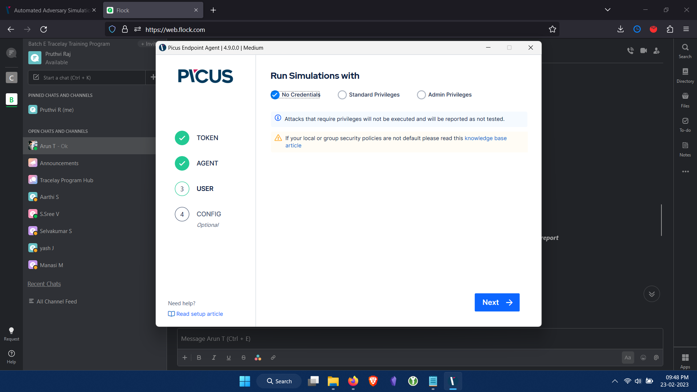
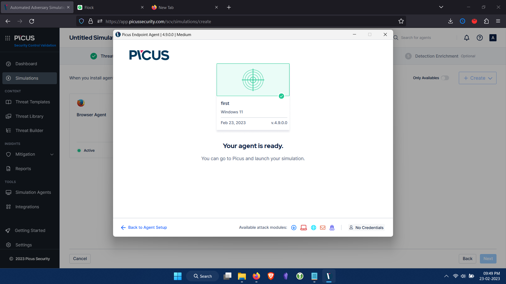
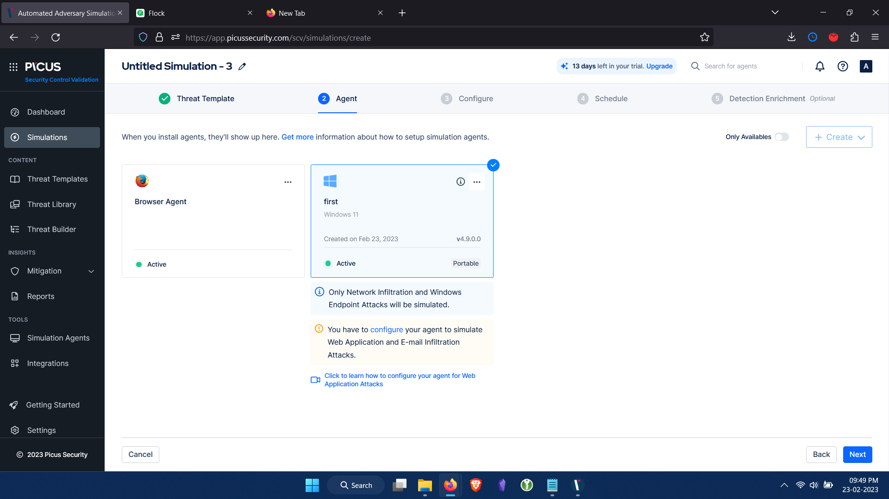
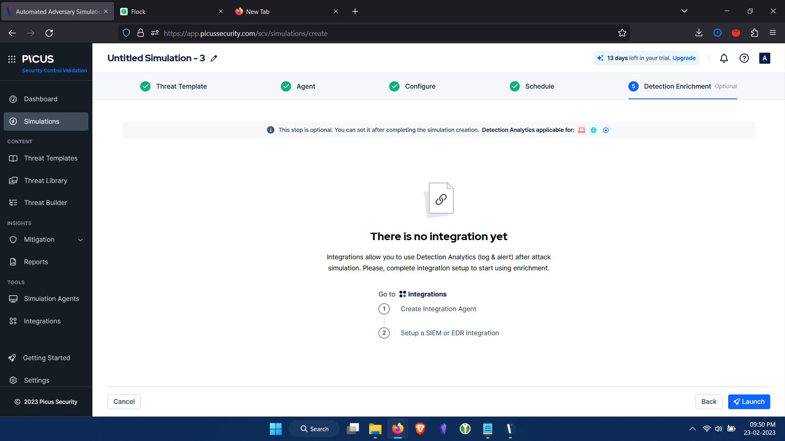
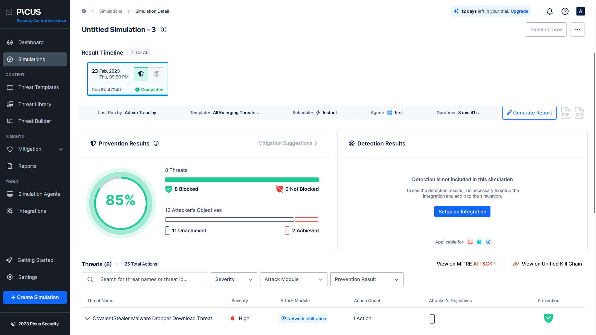
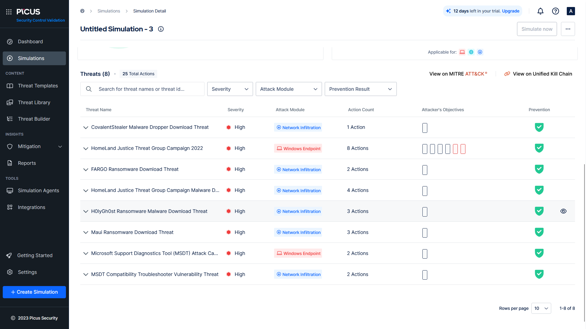
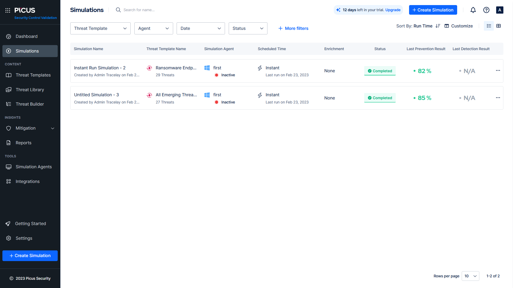
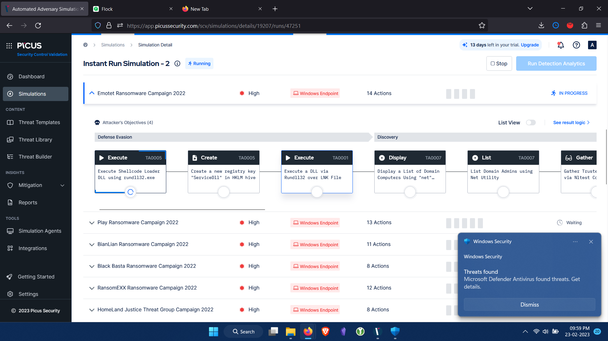
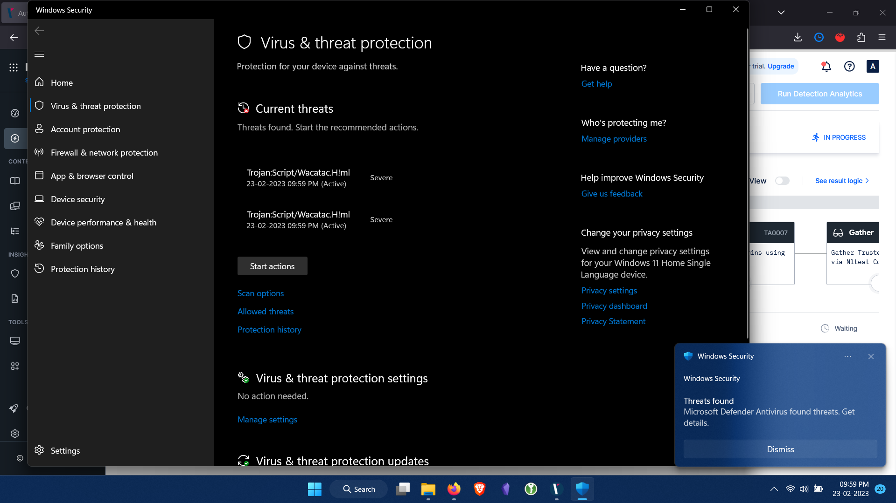
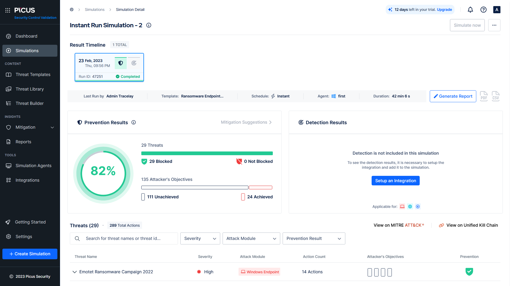

# Picus Security
> Problem Statement: 
> 1. Simulate any 2 attacks scenario from the Template
> 2. Add 3 Threat Name groups details from Threat library of complete attack scenario what you understood in the detailed report
> 3. Do simulation with windows agent or email phishing attack simulation

In 2013, Picus Security pioneered Breach and Attack Simulation (BAS) technology and has helped companies improve their cyber resilience since then.

Established by cybersecurity veterans with academic backgrounds and extensive hands-on experience, Picus Security developed a transformative Security Validation solution for end-to-end attack readiness visibility and effortless mitigation to pre-empt cyber attacks across all cyber defense layers.

Picus’ “The Complete Security Validation Platform” provides granular and actionable insights for operational and executive teams, helps built proactive capabilities, maximizes technology utilization, and thus optimizes return on investment and keeps the risk of getting breached consistently low.

## Picus Simulation
The Picus Complete Security Control Validation Platform is a Breach and Attack Simulation (BAS) solution that helps you to measure and strengthen cyber resilience by automatically and continuously testing the effectiveness of your prevention and detection tools.

- Test your Security Controls 24/7
- Validate Readiness Against The Latest Threats
- Optimize Prevention & Detection Capabilities
- Show the Value of your Investments
- Operationalize MITRE ATT&CK
- Improve SOC Efficiency and Effectiveness

After logging in, for simulating the breach and attack features available on the platform a simulation agent needs to be installed. Installed agent is activated and Threat Template is chosen on windows host PC as OS. 

And the agent is installed for simulation and appears to be active.

Some conditions like only network infiltration and Windows endpoint attacks can be simulated is as shown.

Here the detection options are left out of selection

In all templates option, threats are classified and shown on the basis of categories, like 
- Emerging threats, (Dynamic and static threats)
- Security Posture Management, 
	- Readiness against Ransomware
	- Readiness against APT groups
- Security Control Rationalization 
	- Network Security, 
	- Endpoint Security and 
	- Email Security
- As suggested by Picus Labs

The first option under Emerging threats - *All Emerging Threats Added in the Last Year* is chosen where This template includes all of the emerging threats that were released in the last one year. (dynamic, includes 27 threats)

After running the simualtion, it shows the following on dashboard:

8 threats, all blocked/prevented. 25 actions. 

13 objectives, 2 acheived. 

Most of the ones were not acheived becasue it required root access which was not provided. If provided, it could have catastrophic effect on my PC due to ransomware files used in this BAS activitity.

Few errors were laso encountered along the simulation process.

All 8 threats include:
1. CovalentStealer Malware Dropper Download Threat
2. HomeLand Justice Threat Group Campaign 2022
3. FARGO Ransomeware Download Threat
4. HomeLand Justice Threat Group Campaign Malware Download Threat
5. H0lyGh0st Ransomeware Malware Download Threat
6. Maui  Ransomeware Download Threat
7. MSDT Attack Campaign (CVE-2022-30190)
8. MSDT Compatibilty TroubleShooter Vulnerability Threat

Numerous Threat Groups included here are
1. H0lyGh0st
	- This attack includes downloading an .exe file of the H0lyGh0st Ransomware used by DEV-0530 Threat Group. DEV-0530 has been developing and using ransomware in attacks since June 2021. This group, which calls itself H0lyGh0st, utilizes a ransomware payload with the same name for its campaigns and has successfully compromised small businesses in multiple countries as early as September 2021. This ransomware encrypts all files on the target device and uses the file extension .h0lyenc, sending the victim a sample of the files as proof.
2. Maui
	- This attack includes downloading an .EXE file of the Maui Ransomware. Maui is a ransomware type of malware used by North-Korean-backed threat actors in attacks against Healthcare and Public Health (HPH) organizations since May 2021. State-sponsored cyber actors used Maui ransomware in the incidents to encrypt servers responsible for healthcare services including electronic health records services, diagnostics services, imaging services, and intranet services. The ransomware is designed for manual execution, the remote actor uses command-line interface to interact with the malware and to identify files to encrypt.
3. BlackByte
	- BlackByte is a ransomware-as-a-service operation that is run by a cyber-crime group Symantec calls Hecamede. The group sprang to public attention in February 2022 when [the U.S. Federal Bureau of Investigation (FBI) issued an alert](https://www.ic3.gov/Media/News/2022/220211.pdf) stating that BlackByte had been used to attack multiple entities in the U.S., including organizations in at least three critical infrastructure sectors. In recent months, BlackByte has become one of the most frequently used payloads in ransomware attacks.

Some other threat groups were also seen in the second simulation. (like Emotet, BianLian, BumbleBee, etc.,)
The chosen simualtion template was under security posture management > readiness against ransowmare > ransomware endpoint scenarios (29 threats)

One of the threat ransomware emotet was being simulated and it's internal threat techniques was as shown in MITRE ATT&CK form

Simulateously the endpoint installed microsoft defender was having a field day.

The results of the entire simulation exercise were as shown below:

All attack modules were from windows endpoint, ransomware campaigns. 
29 threats, all blocked/prevented. Out of 135 objectives, 111 was unacheived, 24 acheived.

## Conclusion
2 different attack scenario bundles given in template was executed with windows agent installed.
The results obtained is as shown here in this write-up, along with few threat group details. 