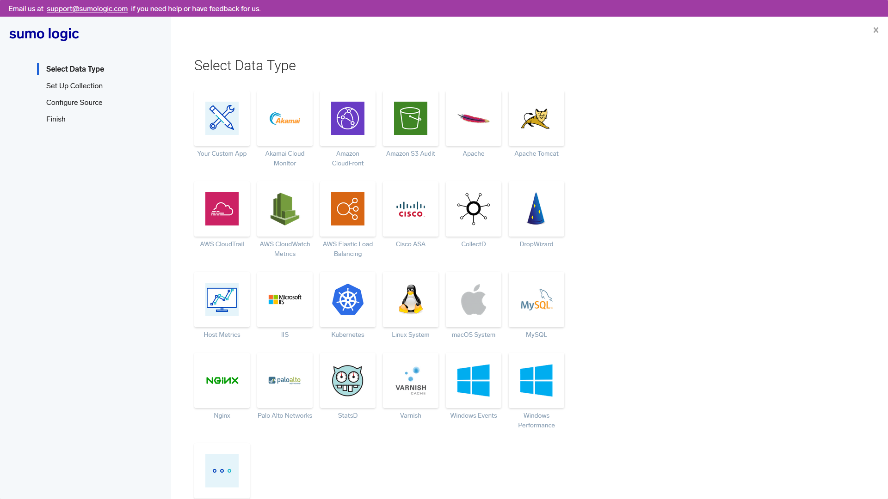
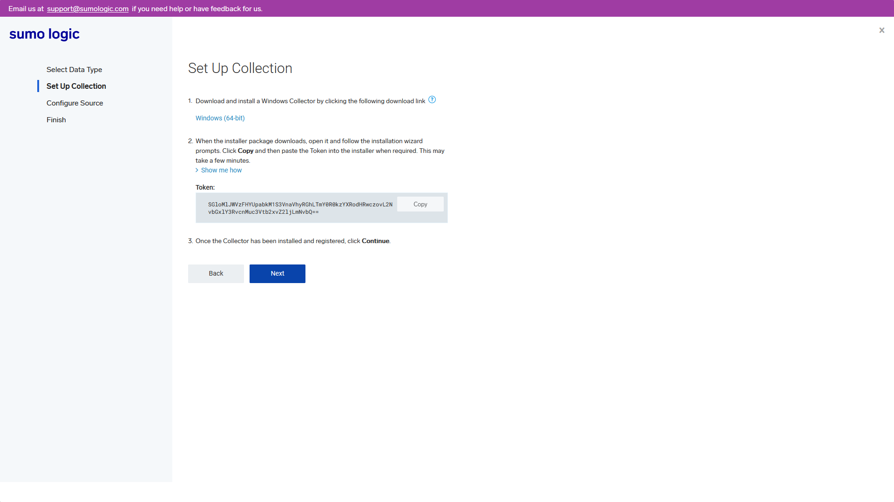
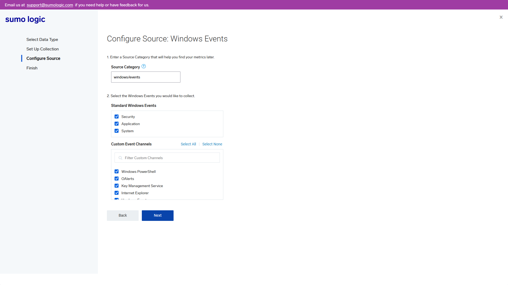
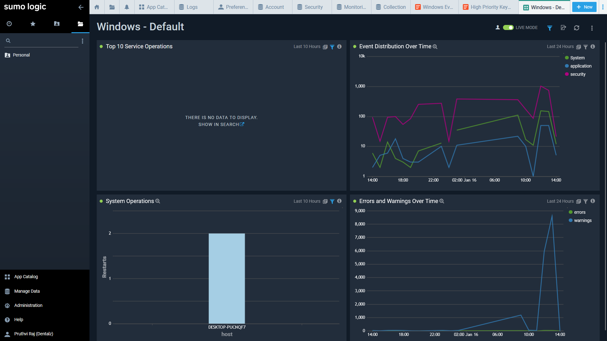
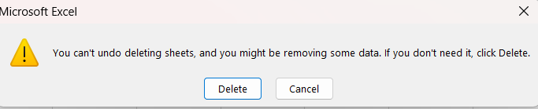
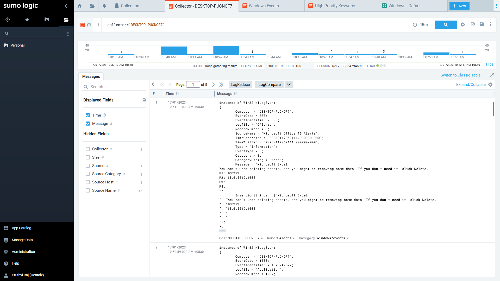

<!--Avoided the home post view page, by posting all these tool exploration under projects-->

Different tools (in their free pricing trial tier) and their capabilities were explored in this exercise.

**Menu Card** / Tools Explored: 

1. [Intezer](../11Nov/2022-11-23-first.html#1-intezer-tool) - Online Malware Detection and Analysis Solution
2. [Sumologic](../11Nov/2022-11-23-first.html#2-sumologic-tool) - SIEM tool
3. [Rapid7](../11Nov/2022-11-23-first.html#3-rapid7) - Web Application Testing Tool
4. [Cybereason](../11Nov/2022-11-23-first.html#4-cybereason-edr) - Endpoint Detection and Response
5. [Picus Simulation](../11Nov/2022-11-23-first.html#5-picus-simulation) - Adversary Attack simulation Tool

---
# 1. Intezer tool
Date of Update: 23/12/2022

> Problem Statement:
>> 1. Identify - Top 5 Publicly Trending Threats in scan option
>> 2. Add any 10 IOC Ip Adress of any threats
>> 3. Add details in report about 2 Sample Threats in Endpoint option

## Top 5 Publicly Trending Threats 
1. REMCOS


2. Tofsee


3. Cutwail


4. QQPass


5. Malicious Packer


## Some Ten IOC IP Address of Threats
Threat - Ave Maria


Threat - Agent Tesla


Threat - Formbook


## Sample Threats in Endpoint
1. **Mustang Panda**  

Country of Origin: China
Synonyms: BRONZE PRESIDENT, HoneyMyte, Red Lich, Mustang Panda - G0129, TA416, RedDelta

This threat actor targets nongovernmental organizations using Mongolian-themed lures for espionage purposes. In April 2017, CrowdStrike Falcon Intelligence observed a previously unattributed actor group with a Chinese nexus targeting a U.S.-based think tank. 

Further analysis revealed a wider campaign with unique tactics, techniques, and procedures (TTPs). This adversary targets non-governmental organizations (NGOs) in general, but uses Mongolian language decoys and themes, suggesting this actor has a specific focus on gathering intelligence on Mongolia. These campaigns involve the use of shared malware like Poison Ivy or PlugX. 

Recently, Falcon Intelligence observed new activity from MUSTANG PANDA, using a unique infection chain to target likely Mongolia-based victims. This newly observed activity uses a series of redirections and fileless, malicious implementations of legitimate tools to gain access to the targeted systems. Additionally, MUSTANG PANDA actors reused previously-observed legitimate domains to host files.


2. TA410

Early in August 2019, Proofpoint described what appeared to be state-sponsored activity targeting the US utilities sector with malware that we dubbed “Lookback”. Between August 21 and August 29, 2019, several spear phishing emails were identified targeting additional US companies in the utilities sector. 

The phishing emails originated from what appears to be an actor-controlled domain: globalenergycertification[.]net. This domain, like those used in previous campaigns, impersonated a licensing body related to the utilities sector. 

In this case, it masqueraded as the legitimate domain for Global Energy Certification (“GEC”). The emails include a GEC examination-themed body and a malicious Microsoft Word attachment that uses macros to install and run LookBack. (Note confusion between Malware, Campaign and ThreatActor)


---

# 2. Sumologic Tool 
Date of Update: 09-01-2023

Link back to the [**Menu Card**](../11Nov/2022-11-23-first.html)

> Problem Statement:
>> 1. First task it to deploy the agent collector deployment is super easy in system once you follow steps.
>> 2. Create a detailed report as per your understanding with screenshot with 3 page report.

### About the company
Sumo Logic, Inc. is a cloud-based machine data analytics company focusing on security, operations and Business Intelligence usecases. It provides log management and analytics services that use machine-generated big data.

Sumo Logic provides best-in-class cloud monitoring, log management, Cloud SIEM tools, and real-time insights for web and SaaS based apps.

### About the tool
Sumo Logic provide a next generation Security Information and Event Management tool for Log Management and analytical services solution that aggregates and analyzes all activities from different resources across entire IT infrastructure.

To enable the log collection for effective management and analytics, a collector is either installed or hosted on Sumo Logic cloud. 

For the activity done, an installed collector is utilised. An Installed Collector is a Java agent that receives logs and metrics from its Sources and then encrypts, compresses, and sends the data to the Sumo service. As its name implies, an Installed Collector is installed in your environment, as opposed to a Hosted Collector, which resides on the Sumo service. After installing a Collector, you add Sources, to which the Collector connects to obtain data to send to the Sumo service. 

A Sumo Source is an object configured for a specific Collector that sends data to Sumo Logic. There are a number of Source types that work with Installed Collectors.

Listed select few are as follows: AWS services (EC2, CloudFront, S3 audit, ELB), Microsoft IIS, Cisco ASA, DropWizard, Linux System, Windows Events, macOS system, MySQL, Nginx, etc.,

As shown in the diagram:



Select Windows Events data type Collector gives a exe file to download which installs a collector. 


A collection setup part will appear where the given token must be copied to link data from system where collector is installed to retrive data from.



Configure source to all window events



finishing the collector installation gives a dashboard where collected data is represented in an analytical cognitive manner.



### Log Collection in Sumologic
Since while log collection, all categories was selected - one of the them being "OAlerts" - Windows Office 15 Alerts

While using Excel Application - there's an alert - while trying to delete charts geenrated from tables in the application.

The alert GUI prompt received:



The prompted alert can be seen as recorded log in Sumologic:



---

# 3. Rapid7
Date of Update: 30-01-2023

Link back to the [**Menu Card**](../11Nov/2022-11-23-first.html)

> Problem Statement:
>> 1. Create a detailed report on vulnerabilities scanned on any 2 web application include vulnerability screenshot and your understandings about the tools.

The company Rapid7 has the insight platform for security solutions. InsightConnect (orchestrationa dn automation), services (expert managed and consulting services), InsightVM (vulnerability management), ThreatCommand (Threat Intelligence), InsightIDR (XDR, SIEM), InsightCloudSec (Cloud Security) and InsightAppSec (Application security dynamic application testing platform) 

InsightAppSec performs black-box security testing to automate identification, triage vulnerabilities, prioritize actions, and remediate application risk.

**Dynamic Application Security Testing (DAST)**  - Get actionable, accurate insights with an industry leading attack framework and library

**Replay attacks & validate fixes** - Speed up remediation and reduce dev team back-and-forth by providing self-service access

**Integrate into dev workflows** - Better prevent risk early by adding security testing as part of the build pipeline and integrating dev and sec team workflows

Opening the tool, it offers demo web app on which scanning can be done to uncover sample vulnerabilities.

A basic site setup can be chosen to work on and it is WebScanTest is done to scan throughly.


This scan uncovers 264 vulnerabilities, with the most critical ones displayed first in the list.


Checking the first vulnerability for details, its CVSS score of 9.8 is a module type of SQL injection. Numerous details like Vulnerability Information, Attack variances discovery history and change history are shown.


The response can also be seen in html form. The Attack variances shows the original traffic request:


```
GET /datastore/search_get_by_name.php?name=Rake HTTP/1.1
Accept: text/html,application/xhtml+xml,application/xml;q=0.9,*/*;q=0.8
Accept-Encoding: gzip, deflate
Accept-Language: en-US
User-Agent: Mozilla/5.0 (Windows NT 10.0; WOW64) AppleWebKit/537.36 (KHTML, like Gecko) Chrome/90.0.4430.24 Safari/537.36
X-RTC-AUTH: R7_IAS
X-RTC-SCANID: ffef3ef3-c05f-4b92-929c-4ecec41eb022
Host: webscantest.com
Referer: http://webscantest.com/datastore/
Cookie: TEST_SESSIONID=ansetkilt12c3itf341m7uscs2; NB_SRVID=srv36063239
X-RTC-REQUESTID: {F668CC2D-09E9-4230-BEEC-BEB664814846}
```

The attack traffic requests too:

```
GET /datastore/search_get_by_name.php?name=Rake%27 HTTP/1.1
Accept: text/html,application/xhtml+xml,application/xml;q=0.9,*/*;q=0.8
Accept-Encoding: gzip, deflate
Accept-Language: en-US
User-Agent: Mozilla/5.0 (Windows NT 10.0; WOW64) AppleWebKit/537.36 (KHTML, like Gecko) Chrome/90.0.4430.24 Safari/537.36
X-RTC-AUTH: R7_IAS
X-RTC-SCANID: ffef3ef3-c05f-4b92-929c-4ecec41eb022
Host: webscantest.com
Referer: http://webscantest.com/datastore/
Cookie: last_search=%3Cscript%3Ealert%6014532645%60%3C%2Fscript%3E; TEST_SESSIONID=ansetkilt12c3itf341m7uscs2; NB_SRVID=srv36063239
X-RTC-REQUESTID: {FECC5626-DFF0-4A78-A29A-FCA051ABC610}
X-RTC-ATTACKTYPE: SQLInjection
```

```
GET /datastore/search_get_by_name.php?name=SELECT%20*%20FROM%20inventory%20WHERE%20name%20%3D%20%26%23039%3BRake%26%23039%3B%26%23039%3B%0A%09%09%09%09%09%09%3Ctr%20style%3D%22height:20%25%3B%20vertical-al HTTP/1.1
Accept: text/html,application/xhtml+xml,application/xml;q=0.9,*/*;q=0.8
Accept-Encoding: gzip, deflate
Accept-Language: en-US
User-Agent: Mozilla/5.0 (Windows NT 10.0; WOW64) AppleWebKit/537.36 (KHTML, like Gecko) Chrome/90.0.4430.24 Safari/537.36
X-RTC-AUTH: R7_IAS
X-RTC-SCANID: ffef3ef3-c05f-4b92-929c-4ecec41eb022
Host: webscantest.com
Referer: http://webscantest.com/datastore/
Cookie: last_search=%F6%3Cscript%3Eprompt%6014532652%60%3C%2Fscript%3E; TEST_SESSIONID=ansetkilt12c3itf341m7uscs2; NB_SRVID=srv36063239
X-RTC-REQUESTID: {16C58994-20A3-4D0B-8438-D25D6190F9A9}
X-RTC-ATTACKTYPE: SQLInjection
```

Each of such vulnerabilities and their attack traffic request and reponse can be assessed. The number of attack traffic varies form vulnerability to vulnerability.

Each such vulnerability can be chosed and their severity can be changed (high, low, medium, informational, safe), status (unreviewed, ignored, false positives, verifired, remediated, duplicates) can be changed and each vulnerability can be exported (to JIRA ticketing system integration or CSV file format).

Similary, an ecommerce site is scanned.


results of the app scan is as follows:


Listed vulnerabilities are sorted with increasing CVSS score first:
The first vulnerability shown is the brute force (form authorization)
Numerous details like Vulnerability Information, Attack variances discovery history and change history are shown.


Similar traffic data, attack traffic of request and response are displayed.

Integrating tool results with JIRA can issue alerts for each vulnerability.
CSV file can be downloaded and basic information can be used in other tool without integration support to transfer data.

DAST is successfully conducted and replay attacks log information is generated.

---

# 4. Cybereason EDR
Date of Update: 09-02-2023

Link back to the [**Menu Card**](../11Nov/2022-11-23-first.html)

> Problem Statement:
>> 1. Create a detailed report on Lateral movment , Command & Control, & Detected ransomare program 
>> 2. In Malop box, write a detailed report on alert detected in Robert-excasst system

EDR is an array of modern, integrated endpoint security tools that detect, contain, investigate, and eliminate invasive cybersecurity threats high in the cyber kill chain. With Cybereason EDR, defenders can stop chasing alerts and instead end malicious operations before they take hold.

Delivering complete endpoint protection from a single, lightweight agent, Cybereason EDR is a full-featured EDR solution designed to catch, analyze, and defend against highly advanced network threats in real-time directly at the endpoint

About the company:
Cybereason is the champion for today’s cyber defenders with future-ready attack protection that extends from the endpoint, to the enterprise, to everywhere. The cybereason Defense Platform combines the industry’s top-rated detection and response (EDR and XDR), next-gen anti-virus (NGAV), and proactive threat hunting to deliver context-rich analysis of every element of a malicious operation (Malop). The result: defenders can end cyber attacks from endpoints to everywhere

Features include:
1. Light endpoint agent
2. Layered malware detection and defense
3. Pre- and post-execution malware inspection
4. Threat feed integration
5. In-memory and application-layer protection
6. Centralized management and user interface

## Features Insights
### Threat Intelligence
Many different threat feeds often do not agree with each other on which IOCs are malicious or unknown. This conflicting information makes it difficult to quickly determine the maliciousness of a threat and take action.

Cybereason Threat Intelligence aggregates multiple threat feeds and cross-examines those feeds against machine learning analysis to rank the various threat feeds based on their historical accuracy for particular types of threats from various adversary groups. This enables Cybereason to determine the correct threat intelligence source to respond quickly and with precision, which simplifies the investigation and response process.

### Instant Remediation
Analysts of all skill levels can quickly dig into the details of an attack without crafting complicated queries, then easily pivot directly from investigating to remediating affected devices by executing a full suite of remediation actions from machine isolation and process killing to removing persistence mechanisms - all from within an intuitive point and click interface.

### Detection Speed and Accuracy
Cybereason EDR can identify threats quickly with a high degree of accuracy using behavioral analysis that leverages cross-machine correlations and enriched data from across all endpoints in real-time, and the Cybereason cross-machine correlation engine drives an impressive 1:200,000 analyst-to-endpoint ratio, significantly reducing the workload for security teams.

### ML-Powered Detection and Correlation of Malicious Behaviors
The Cybereason Defense Platform’s AI surfaces advanced threats by detecting subtle indicators of behavior. Certain malicious behaviors are only identifiable after analyzing enterprise-wide data sets against machine learning. Monitoring via a machine-by-machine basis only can overlook nuanced adversaries whose activity can only be detected when the environment as a whole is analyzed and cross-examined against machine learning.

Once a threat is convicted of being malicious, Defenders need to know the context and other correlated events to deconstruct the entire operation. Cybereason EDR implements machine-learning based deduction to find other artifacts of the operation that are connected to the initial event and compose an automated timeline for rapid response.

### Proven Efficacy
Cybereason EDR earned the highest product score for the “current offering” category in the 2020 Forrester Wave for Enterprise Detection and Response, and the MITRE ATT&CK evaluations highlight the superior proficiency of Cybereason EDR in quickly detecting and correlating threats to instantly deliver the complete story of an attack as an easy to interpret, interactive visual representation.

### Research-Driven Insight
The Cybereason Nocturnus Team evaluates new methodologies to sharpen our prevention, detection and response strategies, uncovering both Indicators of Compromise (IOCs) and key Indicators of Behavior (IOBs), the more subtle signs of an attack derived from across the whole of your network. Whether on premises, mobile or in the cloud, Cybereason is the defender’s choice to reverse the adversary advantage.

## Getting Started
Opening the tool provides Malop (Malware Operations) Inbox where the lab displays some detected activities on dashboard dashboard.


Some malicious tactics of attackers include:
Command and Control (C2) action done after an attacker gains access of a system or network to command access of malicious operations and gain and maintain control of the system.

Lateral Movement means after gaining access to one system of a network, attacker tries to move in the network in same group of permissions to gain more sensitive intel and increase value of their extorted data set.

Privilege Escalation is a type of attack that tries to gain unauthorized access to systems with more permissions or have access to data with higher critical nature in a network after gaining access to some systems.

Infection means to gain unauthorized access to system and ransomware detection is as it says: detecting ransomware.

Given all alerts are sorted by detected activity, time, root cause and machine.


When viewd according to time, starting from bottom to top: there's the infection that occurs first by macro process run when `excel.exe` is executed as IOC (Indicator of Compramise) on ROBERT-EXCASST machine (since as shown in the lab, the tool sensor/collector agent is instaled on two machines) and `powershell.exe` on both MARIAR-CEO and ROBERT-EXCASST machines.

Complete overview about the `excel.exe` is shown as follows,


The timeline shows when `excel.exe` was executed as infection action during the malware operation **malop**.


Looking into what the solution provides on `excel.exe` , that was run on ROBERT-EXECASST machine,


The `psexesvc.exe` is another binary executable file is run for lateral movement from MARIAR-CEO and `powershell.exe` is run on MARIAR-CEO as ransomware. 

`powershell.exe` is also executed as part of infection activity on both hosts which has it's overview displayed by the solution as follows,


In the given lab, some activities like Command and Control (C2) had an `IP address 23.62.75.38` thats recognised and blacklisted (which affected 2 machines) and excel.exe file that ran a macro process that affected one of the system ROBERT-EXCASST and MARIAR-CEO system affected by powershell.exe - which is detected as a ransomware.

## Investigating alerts from host ROBERT-EXCASST
An investigation can be opened relevant to a particular TTP or element or contributing factor. Here the alert seen on a machine say, ROBERT-EXCASST the details can be viewed as follows:

Basic Properties like system name, OS, type, domain, timezone, uptime are displayed for proper introction about the system details.


Suspicious activity is shown by their processes and the complete collected data is also displayed. Further more, system properties are also shown.  


Sensor propeties installed on the host machine in the network for EDR solution to gain data is also shown.


## Further more digging in Cybereason..
Investigation on the basis of process can also be seen with one under inspection. Here, `excel.exe` is seen.


This provides an even better info about differt tools utilized by the attacker on the victim.

Investigation based on different factors can also be done: Machine, User, Process, File, Connection, Domain name, Malop process, DNS query unresolved by IP and many others.
Some hunting queries are already saved.


## Conclusion for Cybereason Tool Exploration
The EDR tool offered by Cybereason recognises suspicious activity - by it's functionality Endpoint Detection and Response, from the hosts thanks to installed sensors. These data collected are properly mapped accordingly with respect to detected activity, time, root cause and machine. Different attack vectors are recognised. 

Critical alerts are shown in a seperate tab with detail specificity. Further more, different profiles can be created by adding whitelisting rules, custom detection rules and reputation of each recognised activity can be searched.

---

# 5. Picus Simulation
Date of Update: 24-02-2023

Link back to the [**Menu Card**](../11Nov/2022-11-23-first.html)

Simulating breach and attack scenarios on PC endpoint using Picus Security's Control Validation Platform solution

> Problem Statement: 
>> 1. Simulate any 2 attacks scenario from the Template
>> 2. Add 3 Threat Name groups details from Threat library of complete attack scenario
>> 3. Do simulation with windows agent or email phishing attack simulation

In 2013, Picus Security pioneered Breach and Attack Simulation (BAS) technology and has helped companies improve their cyber resilience since then.

Established by cybersecurity veterans with academic backgrounds and extensive hands-on experience, Picus Security developed a transformative Security Validation solution for end-to-end attack readiness visibility and effortless mitigation to pre-empt cyber attacks across all cyber defense layers.

Picus’ “The Complete Security Validation Platform” provides granular and actionable insights for operational and executive teams, helps built proactive capabilities, maximizes technology utilization, and thus optimizes return on investment and keeps the risk of getting breached consistently low.

## Picus Simulation
The Picus Complete Security Control Validation Platform is a Breach and Attack Simulation (BAS) solution that helps you to measure and strengthen cyber resilience by automatically and continuously testing the effectiveness of your prevention and detection tools.

- Test your Security Controls 24/7
- Validate Readiness Against The Latest Threats
- Optimize Prevention & Detection Capabilities
- Show the Value of your Investments
- Operationalize MITRE ATT&CK
- Improve SOC Efficiency and Effectiveness

After logging in, for simulating the breach and attack features available on the platform a simulation agent needs to be installed. Installed agent is activated and Threat Template is chosen on windows host PC as OS. 


And the agent is installed for simulation and appears to be active.


Some conditions like only network infiltration and Windows endpoint attacks can be simulated is as shown.


Here the detection options are left out of selection


In all templates option, threats are classified and shown on the basis of categories, like 
- Emerging threats, (Dynamic and static threats)
- Security Posture Management, 
	- Readiness against Ransomware
	- Readiness against APT groups
- Security Control Rationalization 
	- Network Security, 
	- Endpoint Security and 
	- Email Security
- As suggested by Picus Labs

The first option under Emerging threats - *All Emerging Threats Added in the Last Year* is chosen where This template includes all of the emerging threats that were released in the last one year. (dynamic, includes 27 threats)

After running the simualtion, it shows the following on dashboard:


8 threats, all blocked/prevented. 25 actions. 

13 objectives, 2 acheived. 


Most of the ones were not acheived becasue it required root access which was not provided. If provided, it could have catastrophic effect on my PC due to ransomware files used in this BAS activitity.

Few errors were laso encountered along the simulation process.


All 8 threats include:
1. CovalentStealer Malware Dropper Download Threat
2. HomeLand Justice Threat Group Campaign 2022
3. FARGO Ransomeware Download Threat
4. HomeLand Justice Threat Group Campaign Malware Download Threat
5. H0lyGh0st Ransomeware Malware Download Threat
6. Maui  Ransomeware Download Threat
7. MSDT Attack Campaign (CVE-2022-30190)
8. MSDT Compatibilty TroubleShooter Vulnerability Threat

Numerous Threat Groups included here are
1. H0lyGh0st
	- This attack includes downloading an .exe file of the H0lyGh0st Ransomware used by DEV-0530 Threat Group. DEV-0530 has been developing and using ransomware in attacks since June 2021. This group, which calls itself H0lyGh0st, utilizes a ransomware payload with the same name for its campaigns and has successfully compromised small businesses in multiple countries as early as September 2021. This ransomware encrypts all files on the target device and uses the file extension .h0lyenc, sending the victim a sample of the files as proof.
2. Maui
	- This attack includes downloading an .EXE file of the Maui Ransomware. Maui is a ransomware type of malware used by North-Korean-backed threat actors in attacks against Healthcare and Public Health (HPH) organizations since May 2021. State-sponsored cyber actors used Maui ransomware in the incidents to encrypt servers responsible for healthcare services including electronic health records services, diagnostics services, imaging services, and intranet services. The ransomware is designed for manual execution, the remote actor uses command-line interface to interact with the malware and to identify files to encrypt.
3. BlackByte
	- BlackByte is a ransomware-as-a-service operation that is run by a cyber-crime group Symantec calls Hecamede. The group sprang to public attention in February 2022 when [the U.S. Federal Bureau of Investigation (FBI) issued an alert](https://www.ic3.gov/Media/News/2022/220211.pdf) stating that BlackByte had been used to attack multiple entities in the U.S., including organizations in at least three critical infrastructure sectors. In recent months, BlackByte has become one of the most frequently used payloads in ransomware attacks.

Some other threat groups were also seen in the second simulation. (like Emotet, BianLian, BumbleBee, etc.,)
The chosen simualtion template was under security posture management > readiness against ransowmare > ransomware endpoint scenarios (29 threats)


One of the threat ransomware emotet was being simulated and it's internal threat techniques was as shown in MITRE ATT&CK form


Simulateously the endpoint installed microsoft defender was having a field day.


The results of the entire simulation exercise were as shown below:


All attack modules were from windows endpoint, ransomware campaigns. 
29 threats, all blocked/prevented. Out of 135 objectives, 111 was unacheived, 24 acheived.

#### Conclusion for Picus Sumlation Tool Exploration
2 different attack scenario bundles given in template was executed with windows agent installed.
The results obtained is as shown here in this write-up, along with few threat group details. 

---

# Final Scope
Different tools and their capabilities were succesfully explored in this exercise.

Link back to the [**Menu Card**](../11Nov/2022-11-23-first.html)